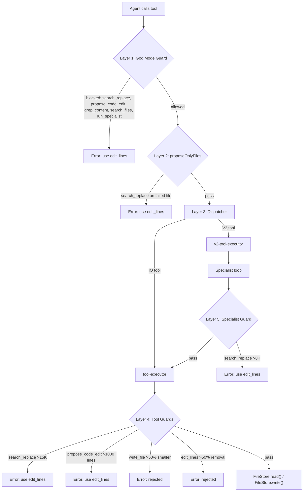

# Synapse Agent Architecture — Engineering Report

**Date:** Feb 25, 2026 (last updated: Feb 25, 2026 — theme map rate limiting, Cursor-like limits)
**Scope:** Full audit of agent orchestration after architecture fix + gap closure sessions
**Status:** All audit bugs fixed. All known gaps closed. 64 tools registered. Scout + theme map + prompt caching documented. High-variant GraphQL tooling + knowledge module added.

---

## 1. Request Lifecycle

**Note:** `buildV2Context()` and the theme map lookup / programmatic scout run **inside** `streamV2()`; the diagram shows their logical order before the main agent loop.

### 1.5 Scout, Theme Map, and Context Pipeline

Before the PM sees any message, the coordinator builds a **structural brief** so the agent gets file targets and line ranges instead of a blind file list. That brief comes from one of two sources; only one runs per request.

**Scout / theme map flow (where Grok is used):**

- **Theme map indexing:** Runs once when the theme is imported or synced. All theme files are sent to **Grok 4** (default `grok-4`, 256K context; indexer accepts an optional 2M-context model for large themes). The response is the theme intelligence map, cached in memory and on disk. No Grok call on later requests until reindex.
- **Per request:** If a theme map exists, `lookupThemeMap()` does a keyword/dictionary match (no LLM). If not, the **programmatic scout** runs (AST chunker + dependency graph, no LLM). Optional **scout LLM enrichment** (Grok Code Fast or Sonnet) is available but **not used by V2**; it would feed into `scoutSection` if enabled.

**Primary: Theme Intelligence Map (cached, zero LLM per request)**

- **What it is:** A pre-computed map of the entire theme: every file's purpose, features (with line ranges), dependencies, and keywords. Built **once** by feeding all theme files to **Grok 4** via `lib/agents/theme-map/indexer.ts`. Model auto-selected: `grok-4` (256K) for small themes, `grok-4-1-fast-reasoning` (2M) for themes >200K tokens. Requires `XAI_API_KEY`.
- **When it runs:** On theme import/sync, `triggerThemeMapIndexing(projectId, files)` runs in the background. Incremental edits call `triggerFileReindex(projectId, file)`.
- **Cache:** In-memory per project (`getThemeMap` / `setThemeMap`) plus disk at `~/.synapse-themes/<projectId>/.theme-map.json`. Cold start loads from disk via `loadFromDisk(projectId)`.
- **Lookup:** For each user request, `lookupThemeMap(themeMap, userRequest)` does a **dictionary-style match** (no LLM): tokenize prompt, score files by path/purpose/pattern/feature keyword overlap, return top targets + related files and a `confident` flag. Result is formatted with `formatLookupResult()` into the section that replaces the scout brief.
- **Context gating:** If the map returns targets, preloaded files are filtered down to those targets + related + active file + prompt-mentioned files. That smaller set is what the PM sees in PRE-LOADED FILES and in the structural brief section.

**Fallback: Programmatic Scout (no theme map or lookup failed)**

- **What it is:** Synchronous, zero-LLM brief built in `lib/agents/scout/structural-scout.ts`. Uses `ThemeDependencyGraph`, AST chunker (`chunkFile`), and symbol matches from the repo map.
- **Flow:** `buildProgrammaticScoutBrief(userRequest, preloadedFiles, graph, symbolMatches)` tokenizes the request, scores AST chunks (schema settings, render calls, CSS rules, JS functions) by keyword overlap, deduplicates overlapping line ranges, and pulls cross-file edges from the graph. Output is a `ScoutBrief` (keyFiles, relationships, suggestedEditOrder, summary). Formatted with `formatScoutBrief(brief)` for the prompt.
- **Context gating:** If the programmatic scout returns key files, preloaded files are filtered to scout key paths + active file + prompt-mentioned, so the PM only sees the gated set.
- **Scout "model":** The **scout action** in the model router is used only for **optional LLM enrichment** (`enrichScoutBrief`). That path is **not used by the V2 coordinator**: theme map lookup + programmatic scout are sufficient. When enrichment is used (e.g. future COMPLEX/ARCHITECTURAL tier), the model is **Grok Code Fast** (`GROK_CODE`) or Sonnet fallback via `resolveModel({ action: 'scout' })`. LLM-enriched briefs can be cached (5 min TTL) via `getCachedScoutBrief` / `cacheScoutBrief`; programmatic briefs are not cached.

**What the PM and specialists receive**

- **Repo map (manifest):** Built every request by `buildRepoMap(files, graph, { activeFilePath, mentionedFiles, maxTokens })` in `lib/context/repo-map.ts`. Structural summary (path, type, line count, schema, renders, symbols) ranked by importance; token budget by tier (e.g. GOD_MODE 8K, ARCHITECTURAL 4K, else 2K). If theme map is used, this manifest is **replaced** by the theme map lookup result as `scoutSection`. If not, the programmatic scout output replaces it; only when both fail does the raw repo map remain as `scoutSection`.
- **User message:** The single "file context" user message contains: user request, optional DOM/diagnostics, `## PRE-LOADED FILES:` (full or outline + scout-targeted line previews for large files), then either `## THEME INTELLIGENCE MAP — ...` or `## STRUCTURAL BRIEF — ...`, then `scoutSection`. That entire message is marked for **prompt caching** (see below).
- **Specialists:** When the PM calls `run_specialist`, the V2 tool executor receives `scoutBrief` and `dependencyContext`. Specialists get:
  - **dependencyContext:** In V2 this is currently `undefined` (dependency context is folded into the PM's preloaded + scout section). In V1 coordinator, dependency context is built from the project context engine and can include scout summary.
  - **scoutBrief:** The executor injects "SCOUT TARGETS" into the specialist task string: for each key file that matches the specialist's scoped files, it appends path, type, relevance, and line ranges with descriptions so the specialist knows exactly which regions to edit.

So: **theme map (cached) → instant lookup → scoutSection + gated preloaded**; or **programmatic scout → scoutSection + gated preloaded**. That same section is in the user message for the PM and, via `scoutBrief`, is passed into specialist tasks as line-range targets.

### 1.6 Context Caching (How Cached Context Is Used)

| Cache                          | What is cached                                                  | Where                                                    | TTL / scope                                                                 | Consumed by                                                                                             |
| ------------------------------ | --------------------------------------------------------------- | -------------------------------------------------------- | --------------------------------------------------------------------------- | ------------------------------------------------------------------------------------------------------- |
| **Theme map**                  | Full theme intelligence (files, purpose, features, deps)        | Memory + `~/.synapse-themes/<projectId>/.theme-map.json` | Until invalidate / reindex                                                  | Lookup on every request → scoutSection, preload gate                                                    |
| **Prompt cache** (Anthropic)   | System message, last history message, file context user message | Provider-side (Anthropic)                                | `promptCacheTtl` (default `1h`); `cacheControl: { type: 'ephemeral', ttl }` | PM iterations: repeated system + file-context message charged as cache hits (~90% input cost reduction) |
| **Scout brief (LLM-enriched)** | Optional enriched ScoutBrief from Grok/Sonnet                   | Namespaced cache `scout-brief` (e.g. Redis or adapter)   | 5 min (`SCOUT_CACHE_TTL_MS`)                                                | Not used by V2; available for future enrichment path                                                    |
| **Repo map**                   | Not cached                                                      | Built per request from current files + graph             | N/A                                                                         | One-off; if theme map/scout used, repo map text is replaced by scoutSection                             |
| **File content (memory)**      | Individual file content by fileId                               | Process-memory Map (`fileContentCache`)                  | 15 min (`CONTENT_CACHE_TTL_MS`)                                             | `loadContent()` waterfall: avoids Supabase round-trip on repeated reads                                 |
| **File content (disk)**        | Individual file content on local filesystem                     | `.cache/themes/{projectId}/{filePath}`                   | Until explicit update/delete                                                | `loadContent()` waterfall: second tier after memory cache miss                                          |
| **File metadata**              | Project file stubs (id, name, path, type — no content)          | Adapter-level cache (`project-files` namespace)          | 5 min (`METADATA_CACHE_TTL_MS`)                                             | Fast initial file listing without loading content                                                       |

**Prompt caching in the coordinator:** System message, last conversation-history message (cache breakpoint), and the single user message that contains PRE-LOADED FILES + scoutSection are each set with `cacheControl: { type: 'ephemeral', ttl: AI_FEATURES.promptCacheTtl }` when `AI_FEATURES.promptCaching` is true (default on). That keeps the large, stable context (files + structural brief) cacheable across PM iterations while tool results and new assistant turns are sent as uncached content.

**Context compression:** `compressOldToolResults(messages)` replaces older tool-result content with short summaries so only the most recent tool round is full length, reducing tokens in later iterations.

**Cache coherence (local-first writes):** `FileStore.write()` follows a local-first pattern: (1) update in-memory `file.content` immediately, (2) update disk cache via `updateCachedFile()`, (3) invalidate `fileContentCache` so stale memory entries don't resurface, (4) fire `onFileChanged` callback, (5) queue background Supabase write with 2-retry backoff + schedule Shopify push. `FileStore.read()` tracks dirty files (written this session) and skips the `loadContent()` waterfall for them — in-memory content is authoritative. This prevents the stale-read bug where the disk cache would override a just-written value. `flush()` is called at session end (both success and error paths) to ensure all background DB writes complete before the coordinator returns.

### 1.7 Theme Map Rate Limiting

Theme map indexing and reindex call the xAI API (Grok). To avoid hitting xAI rate limits (e.g. 480 rpm):

- **429 retry:** Both `indexTheme` and `reindexFile` use `fetchXaiWithRetry()` in `lib/agents/theme-map/indexer.ts`: on HTTP 429 they retry up to 3 times with exponential backoff (1s, 2s, 4s).
- **Debounced reindex:** `triggerFileReindex()` in `lib/agents/theme-map/trigger.ts` no longer calls the API per edit. It adds the file to a per-project dirty set and starts a 5s debounce timer; when the timer fires, it flushes all dirty files sequentially with 200ms between API calls so bursts stay under ~5 req/s. Multiple edits to the same path overwrite (last content wins). Full theme index cancels any pending reindex for that project.
- **Full index:** One index per project at a time (`indexingInProgress`); no cross-project queue. For very high concurrency, consider a global queue or rate limiter.

---

## 2. Tier Classification

Requests are classified into 4 tiers using a heuristic pre-filter (free) with LLM fallback (Haiku).

**Heuristic rules:**

- ARCHITECTURAL: theme-wide keywords (entire theme, full refactor, migrate)
- COMPLEX: multi-file signals (add section, new feature, 3+ file refs)
- TRIVIAL: short cosmetic changes (25 words or fewer with color/font/spacing keywords)
- SIMPLE: everything else

**File-size escalation:** Any target file > 10KB auto-escalates to COMPLEX. Works on both hydrated content and stub files (parses `[N chars]` format).

---

## 3. Strategy Selection

Each tier maps to an execution strategy via `getStrategyFromTier()`:

- TRIVIAL -> SIMPLE (PM edits directly)
- SIMPLE -> HYBRID (PM delegates to specialists)
- COMPLEX -> GOD_MODE (PM edits everything directly)
- ARCHITECTURAL -> GOD_MODE (PM edits everything directly)

The PM can upgrade strategy (HYBRID -> GOD_MODE) by outputting `STRATEGY: GOD_MODE` in its first response. Auto-escalation also occurs when HYBRID stalls (3+ iterations with no edits on COMPLEX+ tier).

---

## 4. Limits Table

**Tuned for real-world large themes and Cursor-like use:** edit quickly, cost secondary. Defaults support large theme files (e.g. 800–1000 line sections), generous iteration counts, higher preloaded caps and tool result size so the agent rarely hits limits mid-task. File-size thresholds live in `lib/agents/tools/constants.ts` (TOOL_THRESHOLDS).

| Parameter              | TRIVIAL  | SIMPLE   | COMPLEX  | ARCHITECTURAL | GOD_MODE    |
| ---------------------- | -------- | -------- | -------- | ------------- | ----------- |
| Strategy               | SIMPLE   | HYBRID   | GOD_MODE | GOD_MODE      | GOD_MODE    |
| Max iterations (code)  | 4–6      | 80       | 80       | 80            | 80          |
| Max iterations (ask)   | 6        | 36       | 36       | 36            | 36          |
| Preloaded file cap     | 6        | 12       | 20       | 50            | **60**      |
| Repo map token budget  | 2000     | 2000     | 2000     | 4000          | **12K**     |
| Graph lookup limit     | 4        | 10       | 10       | 10            | 30          |
| LLM maxTokens          | 4096     | 4096     | 4096     | 4096          | 16384       |
| Pre-edit lookup budget | **24**   | **24**   | **24**   | **24**        | Infinity    |
| Specialist iterations  | 8        | 12       | 16       | 20            | N/A         |
| Max specialist calls   | 16       | 16       | 16       | 16            | 0 (blocked) |
| Total timeout          | 30 min   | 30 min   | 30 min   | 30 min        | 30 min      |
| Tool result truncation | **100K** | **100K** | **100K** | **100K**      | **100K**    |

**File-size thresholds (TOOL_THRESHOLDS):** LARGE_FILE_OUTLINE_CHARS = 16K (above this, show outline + scout regions); GOD_MODE_ESCALATION_CHARS = 10K (above this, escalate to COMPLEX); PROPOSE_CODE_EDIT_BLOCK_LINES = 1000 (above this, use edit_lines).

**Tool result truncation (Cursor-like approach):** The 100K cap is functionally no-limit for theme files. Additionally, the following tools are fully exempt from truncation (always return complete output): read_file, read_lines, read_chunk, parallel_batch_read, extract_region, get_schema_settings, grep_content, semantic_search, glob_files, lint_file, validate_syntax, run_diagnostics, theme_check, list_files, get_file_info. When truncation does apply (rare — only for very large non-exempt tool outputs), the summary shows the first 8K chars with a pointer to the full output. Context budget is enforced at the message level, not the tool-result level.

**Other output limits:**

| Output                         | Limit  | File                  |
| ------------------------------ | ------ | --------------------- |
| V2 specialist/review result    | 32K    | `v2-tool-executor.ts` |
| Grep maxResults (default)      | 300    | `search-tools.ts`     |
| Grep maxTokens (default)       | 20K    | `search-tools.ts`     |
| CSS preloaded file             | No cap | `coordinator-v2.ts`   |
| Shopify asset fetch            | 80K    | `tool-executor.ts`    |
| Preview format                 | 8K     | `preview-tools.ts`    |
| Theme check format             | 24K    | `theme-check.ts`      |
| Large file preview (scout)     | 12K    | `coordinator-v2.ts`   |
| Large file preview (no scout)  | 6K     | `coordinator-v2.ts`   |
| Command output (stdout/stderr) | 1 MB   | `run-command.ts`      |

---

## 5. Complete Tool Inventory (64 tools)

**Count verification:** 64 = 60 tool names in `definitions.ts` (AGENT_TOOLS array including get_product + standalone exports: check_lint, propose_plan, propose_code_edit, ask_clarification, navigate_preview, search_replace, create_file, create_plan, update_plan, read_plan) + 4 V2-only in `v2-tool-definitions.ts` (run_specialist, run_review, get_second_opinion, code_execution). The "edit_node" row in the Code/Debug table is a capability that resolves to edit_lines in the executor, not a separate registered tool name.

### Always Available (Base - 22 tools)

| Tool                  | Purpose                                        | Truncated? |
| --------------------- | ---------------------------------------------- | ---------- |
| read_file             | Read full file content                         | No         |
| read_lines            | Read specific line ranges with numbers         | No         |
| read_chunk            | Read line range with context padding           | No         |
| parallel_batch_read   | Read multiple chunks in one call               | No         |
| extract_region        | Find code by AST hint (fn name, selector)      | No         |
| search_files          | Semantic search across file names/content      | Yes        |
| grep_content          | Regex/substring search across files            | Yes        |
| glob_files            | Find files by glob pattern                     | Yes        |
| semantic_search       | Find files by meaning                          | Yes        |
| list_files            | Full file manifest                             | Yes        |
| get_dependency_graph  | Trace render/include dependencies              | Yes        |
| find_references       | Cross-file reference lookup                    | Yes        |
| get_schema_settings   | Query Liquid schema by section                 | No         |
| run_diagnostics       | Syntax and type diagnostics                    | Yes        |
| theme_check           | Comprehensive Shopify theme validation         | Yes        |
| trace_rendering_chain | Trace layout to template to section to snippet | Yes        |
| check_theme_setting   | Check setting existence/value/usage            | Yes        |
| diagnose_visibility   | Check CSS+Liquid+settings for "not showing"    | Yes        |
| analyze_variants      | Extract variant/option structure from Liquid   | Yes        |
| check_performance     | Static perf analysis (images, scripts, loops)  | Yes        |
| web_search            | Search web (Shopify docs, etc.)                | Yes        |
| fetch_url             | Fetch URL to clean Markdown                    | Yes        |
| check_lint            | Lint a file for errors                         | Yes        |
| read_plan             | Read a saved plan                              | Yes        |

### Code/Debug Mode Only (9 tools)

| Tool              | Purpose                       | Guard                                                      |
| ----------------- | ----------------------------- | ---------------------------------------------------------- |
| edit_lines        | Edit by line number           | Rejects >50% removal                                       |
| edit_node         | Edit by AST node description  | Resolves to edit_lines                                     |
| search_replace    | Find and replace text         | Blocked >15K (executor), >8K (specialists), all (GOD_MODE) |
| propose_code_edit | Full file rewrite             | Blocked >1000 lines, >50% removal, empty                   |
| write_file        | Overwrite file                | Blocked >50% size reduction, empty                         |
| create_file       | Create new file               | --                                                         |
| delete_file       | Delete file                   | --                                                         |
| rename_file       | Rename/move file              | --                                                         |
| undo_edit         | Revert file to pre-edit state | Only files edited in current session                       |

### Orchestration (6 tools)

| Tool                      | Purpose                              | Limit                             |
| ------------------------- | ------------------------------------ | --------------------------------- |
| run_specialist            | Delegate to Liquid/CSS/JS/JSON agent | Max 16 calls, blocked in GOD_MODE |
| run_review                | Review agent validates changes       | --                                |
| get_second_opinion        | GPT-4o second opinion                | --                                |
| ask_clarification         | Ask user with structured options     | --                                |
| propose_plan              | Present plan (plan mode only)        | --                                |
| create_plan / update_plan | Persist plans to DB (plan mode only) | --                                |

### Preview (when connected - 8 tools)

| Tool                | Purpose                        |
| ------------------- | ------------------------------ |
| inspect_element     | Query live DOM by CSS selector |
| get_page_snapshot   | Lightweight DOM tree snapshot  |
| query_selector      | Detailed element info          |
| read_console_logs   | Recent console errors/warnings |
| inject_css          | Inject CSS for live testing    |
| inject_html         | Inject HTML into element       |
| screenshot_preview  | Capture preview screenshot     |
| compare_screenshots | Pixel-diff visual regression   |

### Shopify (6 tools)

| Tool                 | Purpose                                                                                                            |
| -------------------- | ------------------------------------------------------------------------------------------------------------------ |
| push_to_shopify      | Push pending changes to dev theme                                                                                  |
| pull_from_shopify    | Pull latest from Shopify                                                                                           |
| list_themes          | List all themes on store                                                                                           |
| list_store_resources | List products (GraphQL, with variant counts + options), collections, pages                                         |
| get_product          | **NEW** Fetch single product via GraphQL with paginated variants (up to 2000). Essential for high-variant products |
| get_shopify_asset    | Read asset directly from Shopify CDN                                                                               |

### Utility (6 tools)

| Tool                                | Purpose                           |
| ----------------------------------- | --------------------------------- |
| spawn_workers                       | Parallel research workers (max 4) |
| run_command                         | Shell command in project dir      |
| update_scratchpad / read_scratchpad | Per-session memory                |
| generate_image                      | Generate image assets             |
| generate_placeholder                | Generate SVG placeholder          |
| navigate_preview                    | Navigate preview to template      |

### Code Execution (1 tool)

| Tool           | Purpose                                     |
| -------------- | ------------------------------------------- |
| code_execution | Python sandbox, can call PTC-eligible tools |

**PTC-eligible tools (callable from sandbox):** read_file, read_lines, search_files, grep_content, glob_files, list_files, get_dependency_graph, extract_region, run_diagnostics, check_lint, validate_syntax, semantic_search, edit_lines

**Eager streaming tools (large inputs):** propose_code_edit, search_replace, create_file, write_file, edit_lines

---

## 6. Prompt Engineering Stack

**Knowledge modules (injected on-demand by keyword matching):**

- theme-architecture (always loaded)
- liquid-reference (Liquid filters/tags/objects)
- schema-reference (section schema patterns)
- diagnostic-strategy (debugging methodology)
- cx-patterns-summary (customer experience patterns)
- performance-patterns (image loading, lazy loading, caching)
- variant-patterns (high-variant Liquid/JS/CSS patterns, option cascading, availability matrix, 2000-variant support)
- css-architecture (specificity, BEM, variables)
- js-patterns (module pattern, private methods)
- settings-ux (ordering, grouping, conditional settings)

**God Mode prompt (V2_GOD_MODE_OVERLAY) key directives:**

- Mandatory workflow: read_lines -> edit_lines -> check_lint
- BLOCKED: search_replace, propose_code_edit, grep_content, search_files, run_specialist
- ALLOWED: read_file, read_lines, edit_lines, edit_node, extract_region, write_file, create_file, check_lint, theme_check, run_diagnostics, list_files, glob_files, semantic_search, get_dependency_graph, get_schema_settings, find_references

---

## 7. Enforcement Layers (Defense in Depth)

---

## 8. Escalation Chain

| Trigger                                       | Action                                   | New Limits                            |
| --------------------------------------------- | ---------------------------------------- | ------------------------------------- |
| File > 10KB in code mode (stubs parsed)       | Escalate tier to COMPLEX                 | GOD_MODE, 80 iterations               |
| 0 changes after execution (depth < 1)         | Escalate tier (TRIVIAL->SIMPLE->COMPLEX) | Higher tier limits                    |
| HYBRID stalling (3+ iter, no edits, COMPLEX+) | Auto-escalate to GOD_MODE                | 80 iterations, Infinity lookup budget |
| PM outputs STRATEGY: GOD_MODE                 | Manual GOD_MODE activation               | 80 iterations, Infinity lookup budget |
| Execution error                               | Escalate tier + retry                    | Higher tier limits                    |

---

## 9. Content Pipeline (FileStore — Local-First)

**Flush guarantee:** `fileStore.flush()` is called in the coordinator's finalize block (both success and error paths) to `Promise.allSettled()` all pending background DB writes before the session result is returned.

**Cache invalidation on delete/rename:** `delete_file` and `rename_file` tools call `fileStore.invalidateFile()` / `fileStore.invalidateRename()` after successful DB mutation, clearing process memory cache, local disk cache, and metadata cache.

**Large file presentation (>16K chars):**

- Coordinator and specialists show a structural outline (AST chunks with line ranges) instead of full content
- Agent sees chunk types, function names, CSS selectors, and line numbers
- Agent uses read_lines with specific ranges to see the exact region before editing

---

## 10. SSE Events to Client

| Event                | When                      | UI Component                  |
| -------------------- | ------------------------- | ----------------------------- |
| thinking             | During analysis/execution | ProgressRail                  |
| reasoning            | Extended thinking         | ThinkingBlock                 |
| text chunk           | Content generation        | Markdown renderer             |
| tool_start           | Tool begins               | ProgressRail                  |
| tool_call            | Tool completes            | ToolActionItem                |
| tool_result          | Result available          | ToolActionItem                |
| tool_error           | Tool failed               | ToolActionItem                |
| execution_outcome    | Final result              | Status badge + change summary |
| shopify_push         | Shopify sync              | Push indicator                |
| specialist_lifecycle | Specialist state change   | ProgressRail                  |

---

## 11. Audit Results (Post-Fix)

**Architecture checks: 19/19 PASS**

All components correctly wired: dispatcher, FileStore, tool registration, God Mode guards, prompt overlays, Shopify context, structural outlines, handleClientTool removed.

**Bug fixes applied:**

1. MUTATING_TOOL_NAMES duplicates removed (13 entries -> 8 unique)
2. PTC_ELIGIBLE_TOOLS now includes read_lines and edit_lines
3. EAGER_STREAMING_TOOLS now includes edit_lines
4. MAX_SPECIALIST_CALLS error message corrected (8 -> 16)

**Remaining consideration:**

- COMPLEX tier in HYBRID mode has lookup budget of 12 (not Infinity). This is intentional — COMPLEX tasks in HYBRID mode should delegate to specialists rather than the PM exploring extensively. GOD_MODE (which COMPLEX maps to) gets Infinity.

---

## 12. Files Modified in This Session

### New Files (5)

- lib/agents/tools/dispatcher.ts (unified tool routing)
- lib/agents/tools/file-store.ts (single content pipeline)
- lib/agents/specialists/format-file.ts (structural outline for specialist prompts)
- app/projects/[projectId]/loading.tsx (IDE loading skeleton)
- .cursor/rules/shopify-coding-standards.mdc (Cursor agent Shopify standards)

### Key Modified Files (14)

- lib/agents/tools/tool-executor.ts (FileStore, propose_code_edit, undo_edit, analyze_variants, check_performance, guards)
- lib/agents/tools/definitions.ts (undo_edit, analyze_variants, check_performance tool definitions)
- lib/agents/tools/v2-tool-definitions.ts (tool registration, PTC + edit_lines, eager streaming, new tools)
- lib/agents/tools/v2-tool-executor.ts (error message fix)
- lib/agents/coordinator-v2.ts (dispatcher, FileStore, revertHistory, V2_SERVER_TOOLS, outlines, truncation exemption, handleClientTool removal, Shopify context, escalation stub fix)
- lib/agents/prompts/v2-pm-prompt.ts (God Mode rewrite, edit_lines/undo_edit in PM prompts)
- lib/agents/specialists/liquid.ts, css.ts, javascript.ts (search_replace ban, extract_region, format-file)
- lib/agents/knowledge/shopify-best-practices.ts (CSS, JS, Settings UX modules)
- lib/agents/knowledge/liquid-reference.ts (complete filter catalog)
- lib/ai/signal-detector.ts (plan mode false positive fix)
- lib/billing/cost-calculator.ts (Grok model pricing)
- app/api/agents/stream/v2/route.ts (Shopify context threading)
- app/layout.tsx (FOUC fix)
- app/projects/page.tsx (onboarding redirect fix)

---

## 13. Model Routing and Selection

### Available Models (15 across 4 providers)

| Provider  | Model ID                    | Alias          | Input $/1M | Output $/1M | Context |
| --------- | --------------------------- | -------------- | ---------- | ----------- | ------- |
| Anthropic | claude-opus-4-6             | CLAUDE_OPUS    | $15.00     | $75.00      | —       |
| Anthropic | claude-sonnet-4-6           | CLAUDE_SONNET  | $3.00      | $15.00      | —       |
| Anthropic | claude-haiku-4-5-20251001   | CLAUDE_HAIKU   | $1.00      | $5.00       | —       |
| OpenAI    | gpt-4o                      | GPT_4O         | $2.50      | $10.00      | —       |
| OpenAI    | gpt-4o-mini                 | GPT_4O_MINI    | $0.15      | $0.60       | —       |
| Google    | gemini-3-flash-preview      | GEMINI_3_FLASH | $0.50      | $3.00       | —       |
| Google    | gemini-3-pro-preview        | GEMINI_3_PRO   | $2.00      | $12.00      | —       |
| Google    | gemini-2.0-flash            | GEMINI_PRO     | $0.10      | $0.40       | —       |
| Google    | gemini-2.0-flash-lite       | GEMINI_FLASH   | $0.05      | $0.20       | —       |
| xAI       | grok-4 / grok-4-0709        | GROK_4         | $3.00      | $15.00      | 256K    |
| xAI       | grok-4-1-fast-reasoning     | GROK_FAST      | $0.20      | $0.50       | 2M      |
| xAI       | grok-4-1-fast-non-reasoning | —              | $0.20      | $0.50       | 2M      |
| xAI       | grok-4-fast-reasoning       | —              | $0.20      | $0.50       | 2M      |
| xAI       | grok-4-fast-non-reasoning   | —              | $0.20      | $0.50       | 2M      |
| xAI       | grok-code-fast-1            | GROK_CODE      | $0.20      | $1.50       | 256K    |

**Grok rate limits (xAI dashboard):** 2M-context models 4M tpm · 480 rpm; 256K-context (grok-code-fast-1, grok-4-0709) 2M tpm · 480 rpm. Cost-calculator has rates for all above; routing uses GROK_4, GROK_FAST, GROK_CODE.

### Model Routing by Tier and Role

| Tier          | PM Model | Specialist Model      | Review Model | Classifier |
| ------------- | -------- | --------------------- | ------------ | ---------- |
| TRIVIAL       | Sonnet   | Grok Code (or Haiku)  | Sonnet       | Haiku      |
| SIMPLE        | Sonnet   | Grok Code (or Sonnet) | Sonnet       | Haiku      |
| COMPLEX       | Opus     | Sonnet                | Opus         | Haiku      |
| ARCHITECTURAL | Opus     | Opus                  | Opus         | Haiku      |
| Max Quality   | Opus     | Sonnet                | Opus         | Haiku      |

### Model Resolution Priority (10 levels)

1. Forced model (benchmark/test bypass)
2. Max Quality mode -> Opus for PM/review, Sonnet for specialists
3. Tuned model canary (hybrid router)
4. User preference (except classify/summary)
5. Infrastructure actions locked (classify -> Haiku, summary -> Haiku, **scout** -> Grok Code or Sonnet when enrichment used)
6. Tier routing (if tier provided)
7. Grok routing (if XAI_API_KEY set): explain -> Grok-4, document -> Grok Fast
8. Action default (generate -> Sonnet, plan/debug -> Opus, classify -> Haiku)
9. Agent role default (PM -> Opus, specialists -> Sonnet)
10. System default -> Sonnet

### Fallback Chain

Primary -> Sonnet -> Haiku -> Gemini 3 Flash -> Gemini 3 Pro

Circuit breakers filter unhealthy providers before fallback. Additional fallbacks:

- CONTEXT_TOO_LARGE -> reduce openTabs and retry
- Other errors -> fall back to V1 coordinator

---

## 14. Estimated Cost Per Request

| Task Type                             | Model Used           | Avg Input Tokens | Avg Output Tokens | Est. Cost |
| ------------------------------------- | -------------------- | ---------------- | ----------------- | --------- |
| Simple edit (TRIVIAL)                 | Sonnet               | ~8K              | ~2K               | ~$0.05    |
| Feature addition (SIMPLE/HYBRID)      | Sonnet + specialists | ~30K             | ~8K               | ~$0.21    |
| Complex multi-file (COMPLEX/GOD_MODE) | Opus                 | ~80K             | ~15K              | ~$2.33    |
| Architectural refactor                | Opus                 | ~150K            | ~30K              | ~$4.50    |
| Ask/explain question                  | Sonnet               | ~10K             | ~3K               | ~$0.08    |
| Classification (per request)          | Haiku                | ~2K              | ~0.5K             | ~$0.005   |

**Prompt caching reduces input costs by ~90%** when enabled (default: on). Repeated context across iterations is cached.

**Overage markup:** 2x multiplier on requests exceeding plan limits.

---

## 15. Billing Plans and Quotas

| Plan    | Monthly Price | Annual Price | Included Requests/Month | Max Seats | Max Projects | Preview | Publish | Collaboration |
| ------- | ------------- | ------------ | ----------------------- | --------- | ------------ | ------- | ------- | ------------- |
| Starter | $0            | $0           | 50                      | 1         | 1            | No      | No      | No            |
| Pro     | $49           | $470.40      | 500                     | 1         | Unlimited    | Yes     | Yes     | No            |
| Team    | $149          | $1,430.40    | 2,000                   | 5         | Unlimited    | Yes     | Yes     | Yes           |
| Agency  | $349          | $3,350.40    | 6,000                   | 999       | Unlimited    | Yes     | Yes     | Yes           |

**BYOK (Bring Your Own Key):** Organizations with billing_mode='byok' and a valid API key bypass request limits entirely.

**Usage enforcement:** Checked atomically via Postgres RPC before each agent request. Returns 402 if limit exceeded.

**Spending alerts:** Configurable per-organization thresholds with email notifications.

---

## 16. Rate Limits

| Endpoint                      | Requests/Minute |
| ----------------------------- | --------------- |
| /api/agents/stream (V2 agent) | 10              |
| /api/ai/stream                | 20              |
| /api/ai/chat                  | 30              |
| All other endpoints           | 60              |

Identifier: authenticated user ID -> forwarded IP -> real IP -> "unknown".
Backend: Upstash Redis (production), in-memory Map (development).

---

## 17. Feature Flags

| Flag                    | Default | Impact                                                                             |
| ----------------------- | ------- | ---------------------------------------------------------------------------------- |
| godMode                 | ON      | Enables GOD_MODE strategy for complex tasks                                        |
| knowledgeModules        | ON      | Dynamic knowledge injection by keyword                                             |
| semanticSkillMatching   | ON      | Hybrid keyword + word-vector module selection                                      |
| promptCaching           | ON      | ~90% input token cost reduction (Anthropic)                                        |
| adaptiveThinking        | ON      | Claude thinking effort scales with tier                                            |
| contextEditing          | ON      | Auto-clear old tool results to save context                                        |
| promptCacheTtl          | '1h'    | Prompt cache time-to-live                                                          |
| v2Agent                 | OFF     | V2 agent architecture (must be explicitly enabled)                                 |
| programmaticToolCalling | OFF     | PTC disabled — causes broken tool calls                                            |
| structuredOutputs       | OFF     | Structured JSON outputs (Anthropic only)                                           |
| streamingToolUse        | OFF     | Streaming tool use for interactive cards                                           |
| citations               | OFF     | Citation support for Ask/Review modes                                              |
| batchProcessing         | OFF     | Bulk operations via Message Batches API                                            |
| pmExplorationTools      | OFF     | PM reads files before JSON decision                                                |
| conditionalSummary      | OFF     | Skip summary LLM call when PM used tools                                           |
| leanPipeline            | OFF     | Efficiency overhaul single-pass loop                                               |
| previewVerification     | OFF     | Post-edit snapshot + reflection loop                                               |
| scoutEnrichment         | OFF*    | LLM-enriched ScoutBrief (Grok/Sonnet); V2 uses theme map + programmatic scout only |

---

## 18. AI Providers

| Provider  | API               | Models Available                          | Auth              |
| --------- | ----------------- | ----------------------------------------- | ----------------- |
| Anthropic | Native SDK        | Opus, Sonnet, Haiku                       | ANTHROPIC_API_KEY |
| OpenAI    | Native SDK        | GPT-4o, GPT-4o-mini                       | OPENAI_API_KEY    |
| Google    | Google AI SDK     | Gemini 3 Flash/Pro, Gemini 2.0 Flash/Lite | GOOGLE_AI_API_KEY |
| xAI       | OpenAI-compatible | Grok-4, Grok Fast, Grok Code              | XAI_API_KEY       |
| Custom    | OpenAI-compatible | Runtime-registered                        | Per-provider      |

---

## 19. Known Gaps and Future Work

### Closed Gaps (Feb 25 gap closure session)

| #   | Gap                                                    | Resolution                                                                                                     |
| --- | ------------------------------------------------------ | -------------------------------------------------------------------------------------------------------------- |
| 1   | Grok model pricing missing                             | Added rates for grok-4, grok-fast, grok-code to cost-calculator.ts                                             |
| 2   | File-size escalation bug (root cause of test failures) | Fixed stub parsing + lowered threshold from 15K to 10K                                                         |
| 3   | No undo_edit/revert_file tool                          | Built: definition, executor, revertHistory map, registered, prompt updated                                     |
| 4   | No analyze_variants tool                               | Built: option names, swatch patterns, variant loops, availability checks, JS handling                          |
| 5   | No check_performance tool                              | Built: img_url, image_url width, lazy loading, unbounded loops, blocking scripts, inline styles, fetchpriority |

### Remaining Items (operational decisions, not bugs)

| #   | Item                                 | Status           | Notes                                                               |
| --- | ------------------------------------ | ---------------- | ------------------------------------------------------------------- |
| 1   | PTC disabled                         | Feature flag OFF | Anthropic API issue. Enable via ENABLE_PTC=true when stable.        |
| 2   | Preview verification                 | Feature flag OFF | Infrastructure exists. Enable via ENABLE_PREVIEW_VERIFICATION=true. |
| 3   | COMPLEX lookup budget = 12 in HYBRID | Intentional      | COMPLEX maps to GOD_MODE (Infinity). Moot after escalation fix.     |

