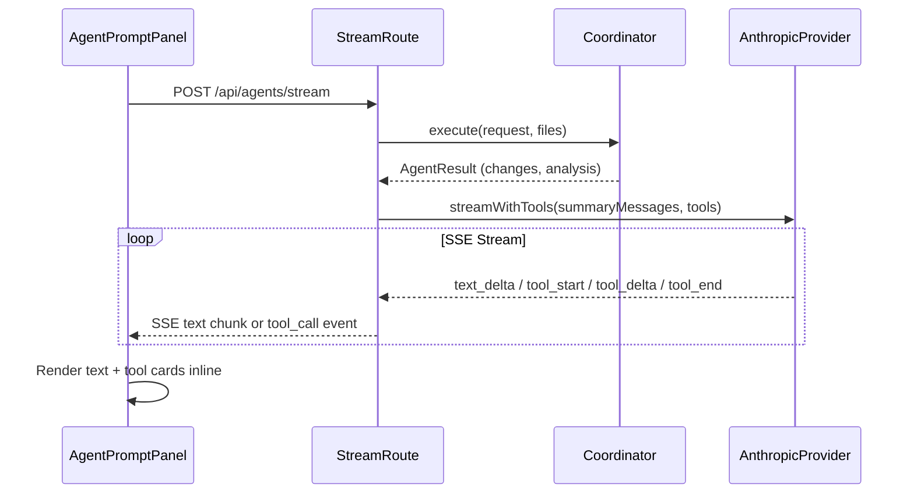

# AI Tool Suite v2 — Streaming Tool Use + Prompt Caching

## Architecture Overview

The current pipeline: **Coordinator -> Summary model (plain text stream) -> Markdown parsing (fragile)**

The new pipeline: **Coordinator -> Summary model (streaming with tools) -> Structured SSE events -> Interactive UI cards**




## Key Anthropic API Features Incorporated

- **Streaming tool use**: New `streamWithTools()` streams tool call parameters in real-time via `content_block_start/delta/stop` events — eliminates the two-phase architecture
- **Prompt caching**: `cache_control: { type: "ephemeral" }` on static system prompt + tool definitions reduces input token costs by ~90% on repeat calls
- **Beta header**: `anthropic-beta: prompt-caching-2024-07-31` required for caching
- **Schema enforcement**: Anthropic already enforces JSON Schema on tool inputs; we add `additionalProperties: false` to all schemas for tighter validation

## Implementation Tiers

### Tier 0 — Types and Provider (no dependencies)

**Step 1: Extend AI types** — [lib/ai/types.ts](lib/ai/types.ts)

- Add `ToolStreamEvent` union type:
  - `{ type: 'text_delta'; text: string }`
  - `{ type: 'tool_start'; id: string; name: string }`
  - `{ type: 'tool_delta'; id: string; partialJson: string }`
  - `{ type: 'tool_end'; id: string; name: string; input: Record<string, unknown> }`
- Add `ToolStreamResult`: `{ stream: ReadableStream<ToolStreamEvent>; getUsage: () => Promise<UsageInfo> }`
- Add `streamWithTools()` to `AIToolProviderInterface`
- Add optional `cache_control?: { type: string }` to `AIMessage` for prompt caching

**Step 2: Implement `streamWithTools()` in Anthropic provider** — [lib/ai/providers/anthropic.ts](lib/ai/providers/anthropic.ts)

- Send `stream: true` + `tools` array in API body
- Add `anthropic-beta: prompt-caching-2024-07-31` header
- Wrap system message with `cache_control: { type: "ephemeral" }` when present
- Parse Anthropic SSE events using a `Map<number, { id, name, jsonChunks }>` accumulation buffer:
  - `content_block_start` (type: `text`) -> emit `text_delta` events from subsequent deltas
  - `content_block_start` (type: `tool_use`) -> emit `tool_start`, begin accumulating
  - `content_block_delta` (type: `input_json_delta`) -> accumulate JSON, emit `tool_delta`
  - `content_block_stop` -> parse accumulated JSON, emit `tool_end`
  - `message_start` / `message_delta` -> capture usage tokens
- Error handling: if JSON parse fails on `content_block_stop`, emit `tool_end` with `{ _error: true }` input
- Timeout: if a tool block has no activity for 30s, emit error event and close

**Step 3: Add `additionalProperties: false` to tool schemas** — [lib/agents/tools/definitions.ts](lib/agents/tools/definitions.ts)

- Add `additionalProperties: false` to each tool's `input_schema` (and nested object schemas)
- This gives tighter schema enforcement without relying on a `strict` flag

### Tier 1 — Stream Route Integration

**Step 4: Update stream route to use `streamWithTools()**` — [app/api/agents/stream/route.ts](app/api/agents/stream/route.ts)

- After coordinator completes, call `selectToolsForRequest(intentMode, request, hasPreview)`
- If tools returned (length > 0 and mode is not `ask`):
  - Cast provider to `AIToolProviderInterface`
  - Call `provider.streamWithTools(budgetedSummary.messages, selectedTools, options)`
  - Consume the `ToolStreamEvent` stream:
    - `text_delta` -> enqueue raw text as before
    - `tool_end` -> enqueue `data: {"type":"tool_call","name":"...","input":{...}}\n\n`
    - `tool_start` -> enqueue `data: {"type":"tool_start","name":"...","id":"..."}\n\n` (for loading UI)
  - On error: fall back to `provider.stream()` without tools (emit thinking event "Tools unavailable, using text mode")
- If no tools: use existing `provider.stream()` path unchanged
- Add prompt caching: set `cache_control: { type: "ephemeral" }` on the system message in `buildSummaryMessages`

**Step 5: Update Ask mode for prompt caching** — same file, `handleAskMode()` function

- Add `cache_control` to the system prompt message (same caching benefit, no tool use)
- No tool support in Ask mode (keep it simple and fast)

### Tier 2 — Frontend SSE Parsing

**Step 6: Extend ChatMessage and SSE parsing** — [components/features/agents/AgentPromptPanel.tsx](components/features/agents/AgentPromptPanel.tsx), [components/ai-sidebar/ChatInterface.tsx](components/ai-sidebar/ChatInterface.tsx)

- Extend `ChatMessage` interface with tool metadata fields:

```typescript
interface ChatMessage {
  // ... existing fields ...
  planData?: { title: string; description: string; steps: PlanStep[]; filePath?: string };
  codeEdits?: Array<{ filePath: string; reasoning?: string; newContent: string; status: 'pending' | 'applied' | 'rejected' }>;
  clarification?: { question: string; options: Array<{ id: string; label: string }>; allowMultiple?: boolean };
  previewNav?: { path: string; description?: string };
  fileCreates?: Array<{ fileName: string; content: string; reasoning?: string; status: 'pending' | 'confirmed' | 'cancelled' }>;
  activeToolCall?: { name: string; id: string }; // Currently streaming tool (for loading state)
}
```

- Add `SSEToolCallEvent` and `SSEToolStartEvent` to `SSEEvent` union type
- In the SSE parsing loop, handle:
  - `tool_start` -> set `activeToolCall` on the current message (shows skeleton/loading card)
  - `tool_call` -> clear `activeToolCall`, route by tool name:
    - `propose_plan` -> create plan file via file API, set `planData` on message
    - `propose_code_edit` -> append to `codeEdits` array
    - `ask_clarification` -> set `clarification` data
    - `navigate_preview` -> auto-navigate preview panel, set `previewNav`
    - `create_file` -> append to `fileCreates` array
- Extend `updateMessage` in [hooks/useAgentChat.ts](hooks/useAgentChat.ts) to accept the new fields

### Tier 3 — UI Components

**Step 7: Create 5 tool UI card components** — `components/ai-sidebar/`

All cards follow a consistent pattern:

- Container: `my-2 rounded-lg border ide-border ide-surface-inset overflow-hidden`
- Primary CTA: `bg-accent text-white hover:bg-accent-hover rounded text-xs font-medium px-3 py-1`
- Secondary button: `ide-text-muted hover:ide-text-2 ide-hover rounded text-xs px-2.5 py-1`
- All interactive elements: `focus-visible:ring-2 focus-visible:ring-accent/50 focus-visible:outline-none`
- Error boundaries: Wrap each card in a try/catch render boundary

**7a. PlanCard.tsx** — Plan with checkable steps, "View Plan" and "Build Ctrl+Enter" footer

- Props: `planData`, `onOpenPlanFile`, `onBuildPlan`, `isBuilding`
- Shows file chip (links to plan file in editor), title, description
- Checkable steps with complexity badges
- Footer: secondary "View Plan" button, primary "Build" button

**7b. CodeEditCard.tsx** — File diff with Apply/Reject

- Props: `edit: CodeEdit`, `onApply`, `onReject`
- File name header with mono font, reasoning text
- Reuse existing `DiffPreview` component for the diff view
- Apply (accent green) / Reject (muted) buttons

**7c. ClarificationCard.tsx** — Question with clickable options

- Props: `clarification`, `onSelect`
- Question text, list of option buttons
- Selecting an option sends it as a normal user message via `onSend`

**7d. PreviewNavToast.tsx** — Compact inline notification

- Props: `previewNav`, `onDismiss`
- External link icon + path text + dismiss X button
- `role="status"` with `aria-live="polite"` for screen readers

**7e. FileCreateCard.tsx** — New file confirmation

- Props: `fileCreate`, `onConfirm`, `onCancel`
- File name header, scrollable code preview (max-h-200px)
- Confirm (accent green) / Cancel (muted) buttons

**Step 8: Wire cards into ChatInterface** — [components/ai-sidebar/ChatInterface.tsx](components/ai-sidebar/ChatInterface.tsx)

- In the assistant message render block, after `MarkdownRenderer`, render tool cards:
  - If `m.activeToolCall` -> show skeleton loading card with tool name
  - If `m.planData` -> render `<PlanCard />`
  - If `m.codeEdits?.length` -> render `<CodeEditCard />` for each
  - If `m.clarification` -> render `<ClarificationCard />`
  - If `m.previewNav` -> render `<PreviewNavToast />`
  - If `m.fileCreates?.length` -> render `<FileCreateCard />` for each
- Remove `PlanApprovalModal` import and all related logic (planSteps, planKey, planModalOpen, etc.)
- Add new props: `onOpenPlanFile`, `onBuildPlan`, `onNavigatePreview`, `onConfirmFileCreate`

**Step 9: Wire through parent page** — [app/projects/[projectId]/page.tsx](app/projects/[projectId]/page.tsx)

- `onOpenPlanFile` -> call `tabs.openTab(filePath)` to open plan file in editor
- `onNavigatePreview` -> call `setEffectivePath(path)` to navigate live preview
- `onConfirmFileCreate` -> call `/api/projects/[projectId]/files` to create the file, then open in a tab

### Tier 4 — Verification

**Step 10: Lint, test, and verify**

- Run `npm run lint` and `npm run test:run`
- Verify: text-only responses still work when model chooses not to use tools
- Verify: tool cards render inline within assistant messages
- Verify: Apply/Reject on CodeEditCard works with existing `onApplyCode` flow
- Verify: Plan file creation opens in editor tab
- Verify: Preview navigation triggers via `setEffectivePath`
- Verify: Error fallback to text-only streaming works
- Verify: Prompt caching header is sent (check network tab)
- Verify: No regressions in Ask mode (no tools, just caching)

## Error Handling Strategy

- **streamWithTools() init failure**: Fall back to `stream()` without tools, emit thinking event
- **Malformed tool JSON**: Emit `tool_end` with `_error` flag, frontend shows "Tool call failed" inline
- **Stream interruption mid-tool**: Discard incomplete tool buffer, continue with text already emitted
- **Tool card render error**: React error boundary catches and shows fallback text
- **Model ignores tools**: Text-only response renders normally via MarkdownRenderer (no tool cards)

## Cost Optimization

- Prompt caching: system prompt (~~2K tokens) + tool definitions (~~1.5K tokens) cached across requests = ~90% reduction on cached tokens
- Tool selection: `selectToolsForRequest()` only sends relevant tools (not all 5) to reduce token overhead
- Ask mode: no tools sent at all (cheapest path)

## Files Changed (summary)

- **Modified**: `lib/ai/types.ts`, `lib/ai/providers/anthropic.ts`, `lib/agents/tools/definitions.ts`, `app/api/agents/stream/route.ts`, `lib/agents/summary-prompt.ts`, `components/ai-sidebar/ChatInterface.tsx`, `components/features/agents/AgentPromptPanel.tsx`, `hooks/useAgentChat.ts`, `app/projects/[projectId]/page.tsx`
- **New**: `components/ai-sidebar/PlanCard.tsx`, `components/ai-sidebar/CodeEditCard.tsx`, `components/ai-sidebar/ClarificationCard.tsx`, `components/ai-sidebar/PreviewNavToast.tsx`, `components/ai-sidebar/FileCreateCard.tsx`
- **Removed**: `PlanApprovalModal` import/usage from ChatInterface (component file kept for now)

