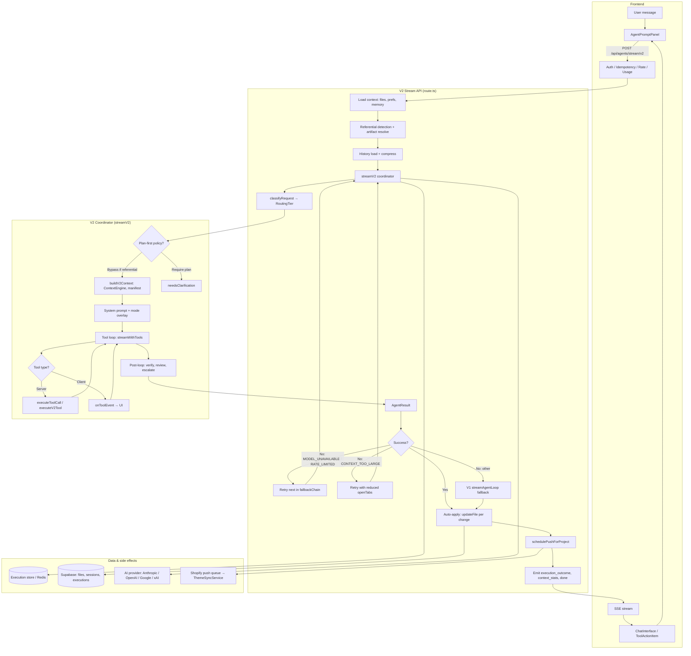

# Synapse IDE — Current Architecture Overview

**Generated:** 2025-02-16  
**Purpose:** Single source of truth for how the Synapse IDE and AI agents work, based on the current codebase. Use this for onboarding, debugging, and planning.

---

## 1. High-Level Stack

| Layer | Tech | Notes |
|-------|------|--------|
| **Frontend** | Next.js 15 (App Router), React, Tailwind, Framer Motion | Project page: `app/projects/[projectId]/page.tsx`; agent chat in right sidebar |
| **API** | Next.js Route Handlers (POST/GET), Server Actions where used | Auth via `requireAuth` / `requireProjectAccess` |
| **Backend** | Node (Next server), Supabase (Postgres + Realtime + Storage), Redis (Upstash) for cache/circuit breaker/execution state | File content: DB or Supabase Storage by size |
| **AI** | Anthropic (primary), OpenAI, Google, xAI (Grok) — streaming tool-use completions | Model selection: `lib/agents/model-router.ts`; xAI via OpenAI-compat at `api.x.ai/v1` when `XAI_API_KEY` set; circuit breaker: `lib/ai/circuit-breaker.ts` |
| **Shopify** | Admin API (themes, assets), OAuth or manual token, encrypted tokens in DB | `lib/shopify/token-manager.ts`, `ThemeSyncService`, `push-queue` |
| **Local dev** | Optional `.synapse-themes/{slug}/` sync, chokidar file watcher | `lib/sync/file-watcher.ts`, `lib/sync/disk-sync.ts` |

---

## 2. Request Flow: User Message → Agent → Files → Preview

### Agent architecture (flowchart)

### 2.1 Entry point (UI)

- **Project page:** `app/projects/[projectId]/page.tsx`
  - Renders: left sidebar (files, store, quality, history), main editor area (Monaco + preview tab), right sidebar (agent chat).
  - **Agent chat:** `AgentPromptPanel` (`components/features/agents/AgentPromptPanel.tsx`) uses:
    - `useAgentChat(projectId)` — sessions, messages, append/update/finalize, session list, archive, fork.
    - `useAgentSettings()` — model, intent mode (code/ask/plan/debug), max agents, verbose (localStorage).
  - On submit, the panel:
    - Picks stream endpoint: `NEXT_PUBLIC_ENABLE_V2_AGENT !== 'false'` → `POST /api/agents/stream/v2`, else `POST /api/agents/stream`.
    - Sends body: `projectId`, `sessionId`, `request`, `history`, `model`, `intentMode`, `activeFilePath`, `openTabs`, `explicitFiles`, `elementHint`, `domContext`, optional `isReferentialCodePrompt` and `referentialArtifacts` (when the last assistant turn had proposed changes and the user says e.g. "yes", "apply", "do it").
    - Reads SSE stream and maps events to thinking steps, tool cards, `change_preview`, `execution_outcome`, etc.

### 2.2 V2 stream API (`app/api/agents/stream/v2/route.ts`)

1. **Auth:** `requireAuth(req)` → 401 if missing.
2. **Idempotency:** `checkIdempotency(req)` → return cached response if duplicate.
3. **Validation:** `streamSchema` (projectId, request, optional sessionId, history, model, intentMode, activeFilePath, openTabs, explicitFiles, elementHint, isReferentialCodePrompt, referentialArtifacts, subagentCount).
4. **Rate limit:** `checkRateLimit(req)` → 429 if over.
5. **Usage:** `checkUsageAllowance(userId)` → 402 if over plan.
6. **Circuit breaker + model list:** Build `fallbackChain` (user model, then Claude Sonnet, Haiku, Gemini Flash, Pro); drop models whose provider circuit is open (`isCircuitOpen(provider)`).
7. **Stream controller:** `ReadableStream` with:
   - **Load context in parallel:** `loadProjectFiles(projectId)`, `user_preferences` (by userId), `developer_memory` (projectId + userId) → `memoryContext` string.
   - **Referential detection:** If intent is code and (body says "yes"/"apply"/etc. or body has `isReferentialCodePrompt`), set `referentialCodePrompt`; if so and no `referentialArtifacts` in body, call `resolveReferentialArtifactsFromExecutions(...)` to get recent proposed changes from DB.
   - **History:** If `sessionId`, `loadHistoryForCoordinator(sessionId)` then `compressHistoryForBudget(...)`; else `trimHistory(body.history, budget)`.
   - **Run coordinator:** `streamV2(executionId, projectId, userId, body.request, fileContexts, prefResult, coordinatorOptions)` with `onProgress`/`onContentChunk`/`onToolEvent`/`onReasoningChunk` forwarding to SSE.
   - **Model fallback:** If result is failure with `MODEL_UNAVAILABLE` or `RATE_LIMITED`, retry with next in `fallbackChain` (emit thinking event).
   - **CONTEXT_TOO_LARGE retry:** If error is `CONTEXT_TOO_LARGE`, retry with reduced `openTabs`.
   - **V1 fallback:** If still failing (and not model/context), call `AgentCoordinator.streamAgentLoop(...)` once.
   - **Token usage:** `recordUsageBatch(...)` for org billing.
   - **Outcome:** Compute `outcome`: `applied` | `no-change` | `blocked-policy` | `needs-input` from `result.changes`, `result.needsClarification`, and plan-first message.
   - **Auto-apply:** If `outcome === 'applied'` and `result.changes.length > 0`: for each change resolve `fileId` (by path/name/basename), skip if >50% content loss (destructive guard), then `updateFile(fileId, { content: proposedContent, userId })`, `invalidateFileContent(fileId)`; then `schedulePushForProject(projectId)` and emit `shopify_push` (scheduled).
   - **Emit:** `execution_outcome` (outcome, changedFiles, needsClarification, failureReason, suggestedAction, failedTool, failedFilePath, reviewFailedSection, verificationEvidence), then `context_stats`, then `data: [DONE]`.
8. **Heartbeat:** Every 45s emit a thinking keepalive.
9. **Errors:** On unhandled error, emit SSE error event and close stream.

### 2.3 V2 coordinator (`lib/agents/coordinator-v2.ts`)

- **`streamV2(executionId, projectId, userId, userRequest, files, userPreferences, options)`**
  - **Classification:** `classifyRequest(userRequest, files.length)` → heuristic + optional LLM → `RoutingTier`: TRIVIAL | SIMPLE | COMPLEX | ARCHITECTURAL.
  - **Tier override:** If `options._tierOverride` (e.g. from escalation), use it.
  - **Plan-first policy:** `shouldRequirePlanModeFirst({ intentMode, tier, userRequest, recentMessages, isReferentialCodePrompt })`; if true, inject plan-required message and set `needsClarification` (referential code prompts bypass plan-first).
  - **Context:** `buildV2Context(projectId, files, userRequest, options, tier)` → ContextEngine indexing, `selectRelevantFiles`, dependency/graph boosts, theme-topic boosts, manifest; returns `preloaded`, `allFiles`, `manifest`. Style-aware refs (reference sections, main CSS, snippet consumers) added to `preloadedMap`.
  - **System prompt:** V2 PM prompt + mode overlay (code/plan/ask/debug) + knowledge modules + style profile; optional design context.
  - **Execution store:** `createExecution(executionId, ...)` (Redis); later `updateExecutionStatus`, `persistExecution` (Supabase), `setReviewResult`, `addMessage`.
  - **Main loop (until max iterations or stop):**
    - **Budget:** `enforceRequestBudget(messages, ...)` (tier-based).
    - **Tools:** `selectV2Tools(intentMode, hasPreview, enablePTC)` (includes `run_specialist`, `run_review` when applicable).
    - **Provider:** `getAIProvider(getProviderForModel(model))`; if not tool-capable, fallback to text-only and exit with clarification message.
    - **Stream:** `provider.streamWithTools(messages, tools, options)`; accumulate content deltas and tool calls.
    - **Tool handling:**
      - **Server tools** (read_file, search_files, grep_content, glob_files, semantic_search, list_files, get_dependency_graph, theme_check, run_diagnostics, run_specialist, run_review): executed server-side. `groupByFileOwnership(pending)` splits into parallel (different files) vs sequential; parallel batch runs in parallel, then sequential. Results cached in `toolOutputCache` for long outputs; `read_file` preloads into `preloadedMap`. Mutating tools: `search_replace` / `create_file` via `executeToolCall`; on repeated mutation failure per file, `proposeOnlyFiles` forces fallback to `propose_code_edit` and injects system correction text.
      - **Client tools** (propose_code_edit, search_replace, create_file, etc.): forwarded via `onToolEvent`; when client sends back result (or synthetic apply), handled in `handleClientTool` and merged into `accumulatedChanges` and in-memory file state.
    - **Mutation failure tracking:** `failedMutationByFile`, `lastMutationFailure`, `proposeOnlyFiles`; after threshold, inject correction and optionally escalate.
    - **Referential replay:** If after loop we have referential prompt and no changes and no clarification, `applyReferentialArtifactsAsChanges(...)` applies past artifacts to `accumulatedChanges` and updates `preloadedMap`.
    - **Clarification:** If code mode and no changes and direct mutation requested, set `needsClarification` and optionally `buildFallbackClarificationOptions`.
    - **Compress old tool results:** `compressOldToolResults(messages)` (when context editing not used).
  - **Post-loop:**
    - **Auto-review:** For COMPLEX/ARCHITECTURAL or multi-file/layout changes, call `run_review` and set `latestReviewResult`.
    - **Verification:** `verifyChanges(accumulatedChanges, allFiles)` (syntax); if theme context, `runThemeCheck(projectedFiles)` and merge issues; build `verificationEvidence`.
    - **Change-set validation:** `validateChangeSet(accumulatedChanges, allFiles)`; theme artifact + policy checks; `enforceFileContextRule` (reject edits to files not read).
    - **Tier escalation:** If code/debug, zero changes, no substantive analysis, and escalation depth < 1, retry `streamV2` with `_tierOverride: escalateTier(tier)` and `_escalationDepth + 1`.
    - **Finalize:** `updateExecutionStatus(executionId, ...)`, `persistExecution(executionId)`; fire-and-forget `learnFromExecution` (term mapping), `recordTierMetrics`.
  - **Return:** `AgentResult` (success, analysis, changes, reviewResult, needsClarification, usage, verificationEvidence, failureReason, suggestedAction, failedTool, failedFilePath).

### 2.4 Tool execution

- **Generic (read/search/grep/lint/diagnostics/etc.):** `lib/agents/tools/tool-executor.ts` — `executeToolCall(toolCall, ctx: ToolExecutorContext)` with `files`, `contextEngine`, `projectId`, `userId`, `loadContent`, `sessionId`.
- **V2-only (run_specialist, run_review):** `lib/agents/tools/v2-tool-executor.ts` — `executeV2Tool(toolCall, ctx: V2ToolExecutorContext)`; specialists (Liquid, JS, CSS, JSON) and review agent run in sub-loops; virtual worktrees (`createWorktree`, `mergeMultipleWorktrees`) for parallel specialists; lifecycle and reactions via `onSpecialistLifecycleEvent` and reaction rules.

### 2.5 File writes and Shopify push

- **Agent auto-apply (V2 route):** As above: `updateFile(fileId, { content, userId })` → `lib/services/files.ts` → Supabase `files` update (and optional Storage for large content); `invalidateFileContent(fileId)`; then `schedulePushForProject(projectId)`.
- **Manual file save (IDE):** `PUT /api/files/[id]` with `body.content` → same `updateFile` + invalidate; then if project has `shopify_connection_id`, upsert `theme_files` (connection_id, file_path, sync_status: pending) and `schedulePushForProject(projectId)`; if local sync enabled, `writeFileToDisk(slug, path, content)`.
- **Push queue:** `lib/shopify/push-queue.ts` — `schedulePushForProject(projectId)` debounces; `runPushForProject(projectId)` runs `ThemeSyncService.pushTheme(...)`, then invalidates preview cache and calls `emitPreviewSyncComplete(projectId)` (in-process). File watcher can call `POST /api/internal/schedule-push` with `{ projectId }` (CRON_SECRET) to schedule push.
- **Preview refresh:** Client listens for `PREVIEW_SYNC_EVENT` (`lib/preview/sync-listener.ts`); `usePreviewRefresh(projectId, onRefresh)` debounces and calls `onRefresh` so the preview iframe reloads.

### 2.6 Change preview (approve/reject) flow

- When the UI receives a `change_preview` SSE event (or has proposed changes and outcome is not auto-applied), it shows `ChangePreviewCard` with diff and Approve/Reject.
- **Approve:** `POST /api/agents/executions/[id]/approve` with `{ projectId }` → applies changes to DB files, invalidates cache, upserts `theme_files`, runs push, captures after screenshot → returns `appliedCount`, optional before/after screenshot URLs.
- **Reject:** `POST /api/agents/executions/[id]/reject` with `{ projectId }` → execution status set to failed and persisted.

---

## 3. Data and Storage

### 3.1 Supabase (Postgres)

- **files:** id, project_id, name, path, file_type, size_bytes, content (nullable), storage_path (nullable), created_by, created_at, updated_at. Large content in Storage; loader uses `downloadFromStorage` when content is null.
- **projects:** id, name, organization_id, owner_id, shopify_connection_id (optional), etc.
- **ai_sessions:** id, project_id, user_id, provider, model, title, lines_added, lines_deleted, files_affected, archived_at, created_at, updated_at.
- **ai_messages:** id, session_id, role, content, metadata (toolCalls/toolResults), input_tokens, output_tokens, feedback_rating, feedback_comment, feedback_at, created_at.
- **agent_executions:** id, project_id, user_id, session_id, user_request, status, execution_log, proposed_changes, review_result, started_at, completed_at, created_at.
- **developer_memory:** project_id, user_id, type, content (JSON), confidence, feedback, etc.
- **user_preferences:** user_id, category, key, value, file_type, confidence, observation_count, etc.
- **shopify_connections:** id, user_id, project_id, store_domain, access_token_encrypted, theme_id, is_active, sync_status, scopes, last_sync_at, etc.
- **theme_files:** connection_id, file_path, sync_status, created_at, updated_at (pending → pushed).
- **file_embeddings:** project_id, file_id, file_name, chunk_index, chunk_text, content_hash, embedding (vector), model_version (when pgvector enabled).

### 3.2 Redis (Upstash)

- **Execution state:** executionId → status, messages, proposedChanges, reviewResult (see `lib/agents/execution-store.ts`). Persisted to Postgres on completion.
- **Cache:** `lib/cache/cache-adapter.ts` — namespaced keys (e.g. metrics, circuit breaker). Memory adapter used when Redis not configured.
- **Circuit breaker:** Per-provider state (closed / open / half_open) and probe lock.

### 3.3 File loader and cache

- **`lib/supabase/file-loader.ts`:** `loadProjectFiles(projectId, supabase)` returns `{ allFiles: FileContext[], loadContent: LoadContentFn }`. Metadata from DB (and optional in-memory project cache); content loaded on demand via `loadContent(fileIds)`, with per-file content cache and Storage fetch for large files. `invalidateFileContent(fileId)` / `invalidateProjectFilesCache(projectId)` bust caches.

---

## 4. Agent Classification and Orchestration

- **Classifier:** `lib/agents/classifier.ts` — `heuristicClassify(request, fileCount)` (keywords, length) and `classifyWithLLM(request, fileCount)`; `classifyRequest` uses heuristic first, then LLM for edge cases. Output: `RoutingTier` (TRIVIAL, SIMPLE, COMPLEX, ARCHITECTURAL).
- **Orchestration policy:** `lib/agents/orchestration-policy.ts` — `shouldRequirePlanModeFirst({ intentMode, tier, userRequest, recentMessages, isReferentialCodePrompt })`; `buildPlanModeRequiredMessage(tier)`; `hasPlanApprovalSignal(recentMessages, userRequest)`; `getReferentialPolicy()`.
- **Model router:** `lib/agents/model-router.ts` — `resolveModel({ action, agent, tier, userModel })`; `getProviderForModel(model)` → anthropic | openai | google | **xai**. `MODELS` includes **xAI (Grok):** `GROK_4`, `GROK_FAST`, `GROK_CODE`. When `XAI_API_KEY` is set, **chat** uses `grok-4` and **summary** uses `grok-4-1-fast-reasoning`; orchestration stays on Claude. Provider `xai` is implemented in `lib/ai/get-provider.ts` via OpenAI-compat client (`https://api.x.ai/v1`). `MODEL_MAP`, `AGENT_DEFAULTS` define defaults per action/agent/tier. (Circuit breaker currently lists only anthropic, openai, google.)

---

## 5. Feature Flags and Env

- **`lib/ai/feature-flags.ts`:** `AI_FEATURES` — promptCaching, adaptiveThinking, streamingToolUse, v2Agent, programmaticToolCalling (PTC), leanPipeline, contextEditing. Driven by env (e.g. `ENABLE_V2_AGENT`, `ENABLE_PTC`, `AGENT_LEAN_PIPELINE`). V2 is default in UI unless `NEXT_PUBLIC_ENABLE_V2_AGENT === 'false'`.
- **Vector search:** `ENABLE_VECTOR_SEARCH === 'true'` enables embedding index and warm-embeddings task; `lib/ai/embeddings.ts`, `lib/ai/vector-store.ts`, `lib/tasks/built-in/warm-embeddings.ts`.

---

## 6. Chat and Sessions API

- **Sessions:** `GET/POST /api/projects/[projectId]/agent-chat/sessions` (list with archived filter, search, pagination; create or reuse empty). `GET/PATCH/DELETE /api/projects/[projectId]/agent-chat/sessions/[sessionId]`. `POST .../sessions/[sessionId]/fork` (branch at index). `POST .../sessions/[sessionId]/apply-stats` (increment lines_added/lines_deleted/files_affected).
- **Messages:** `GET/POST /api/projects/[projectId]/agent-chat` (recent session + messages; save message). `GET/POST .../sessions/[sessionId]` (messages for session; save). `POST .../messages/[messageId]/feedback` (thumbs up/down, optional comment; thumbs-down + comment can create developer_memory).
- **Review transcript:** `POST .../sessions/[sessionId]/review` — Supabase Edge Function or heuristic analysis for loop/UX.

---

## 7. Executions and Approve/Reject

- **List:** `GET /api/agents/executions?projectId=&sessionId=&limit=&offset=`.
- **Get/approve/reject:** `GET /api/agents/executions/[id]`; `POST` with action approve/reject; `POST /api/agents/executions/[id]/approve` (apply changes, push, screenshots); `POST /api/agents/executions/[id]/reject` (mark failed).

---

## 8. Files and Projects API

- **Global files:** `POST /api/files` (create), `GET/PUT/PATCH/DELETE /api/files/[id]` (read, content update, rename, delete). PUT updates content and triggers theme_files upsert + schedulePush + optional disk sync.
- **Project files:** `GET /api/projects/[projectId]/files` (list; optional file_type, search, include_content). `POST` (create file; optional disk write). `POST .../files/upload` (ZIP import, theme dirs, design ingestion). `POST .../files/batch` (bulk create). `GET .../files/count` (lightweight count for import polling).
- **Sync to disk:** `POST /api/projects/[projectId]/sync-to-disk` — writes all text files to `.synapse-themes/{slug}/`, starts file watcher if enabled.

---

## 9. Shopify and Stores

- **Stores (user-scoped):** `GET /api/stores?active=true&projectId=` (active or list); `POST` (connect: storeDomain, adminApiToken, projectId); `PATCH` (switch active: connectionId, projectId). Token stored encrypted via `ShopifyTokenManager`; active connection resolved by user_id + is_active or by project’s shopify_connection_id.
- **Project Shopify:** `GET/POST/DELETE /api/projects/[projectId]/shopify` (connection status, connect manual, disconnect). `POST .../shopify/sync` (action: pull | push; themeId; note). Themes: list, delete, rename, clone, publish, diff. Sync uses `ThemeSyncService.pullTheme` / `pushTheme`; push guarded by quick scan (`quickScanTheme`); push history recorded.
- **Internal:** `POST /api/internal/schedule-push` (body: projectId; CRON_SECRET) → `schedulePushForProject(projectId)`.

---

## 10. Middleware and Auth

- **middleware.ts:** Stub `/web-pixels` to 200; protect routes: require auth for /projects, /account, /api (except public); redirect unauthenticated to /auth/signin; allow /auth/signin and signup/callback.
- **lib/middleware/auth.ts:** `requireAuth(request)`, `requireProjectAccess(request, projectId)`, `requireOrgAccess`, `requireAdmin`. Cookie or Bearer; service role for server-side admin.

---

## 11. Background and Cron

- **instrumentation.ts:** On Node start: start file watcher (if local sync enabled), init hybrid router, schedule node-cron jobs (non-Vercel).
- **Cron:** `GET /api/internal/cron` (CRON_SECRET) → task runner schedule + dispatch. `GET /api/cron/report-overage` → usage overage reporting (Stripe).
- **Agent job queue:** `lib/tasks/agent-job-queue.ts` — Postgres-backed queue; `enqueueAgentJob`, `claimNextAgentJob`, `pollExecutionProgress`, `triggerDispatch`. `POST /api/internal/agent-dispatch` (CRON_SECRET) claims and runs jobs via coordinator.

---

## 12. Theme and UI

- **Theme (dark default):** `useTheme()` in `hooks/useTheme.ts` — sessionStorage `synapse-theme-session` (dark by default); legacy `synapse-theme` in localStorage cleared. Root layout inline script sets class and color-scheme from sessionStorage so first paint is correct.
- **Design system:** `app/globals.css` — stone neutrals, sky interactive, accent green #28CD56; bg-[#fafaf9] / dark:bg-[#0a0a0a]; borders stone-200 / dark:white/5; GlassCard, typography. Preloader uses `bg-[#fafaf9] dark:bg-[#0a0a0a]` and `text-stone-900 dark:text-white`.

---

## 13. Observability

- **Tracer:** `lib/observability/tracer.ts` — span-based; persisted to `agent_traces` (Supabase).
- **Metrics:** `lib/observability/metrics.ts` — Redis-backed counters/histograms (agent.requests, agent.errors, agent.tokens, latency, cache hits/misses, verification pass/fail).
- **Logger:** `lib/observability/logger.ts` — Pino; pretty in dev, JSON in prod; module child loggers.

---

## 14. Key File Reference

| Area | Path |
|------|------|
| V2 stream route | `app/api/agents/stream/v2/route.ts` |
| V1 stream route | `app/api/agents/stream/route.ts` |
| Execute (sync) | `app/api/agents/execute/route.ts` |
| Agent dispatch | `app/api/internal/agent-dispatch/route.ts` |
| V2 coordinator | `lib/agents/coordinator-v2.ts` |
| V1 coordinator | `lib/agents/coordinator.ts` |
| Classifier | `lib/agents/classifier.ts` |
| Orchestration policy | `lib/agents/orchestration-policy.ts` |
| Model router | `lib/agents/model-router.ts` |
| AI provider factory (incl. xAI) | `lib/ai/get-provider.ts` |
| Tool definitions | `lib/agents/tools/definitions.ts`, `lib/agents/tools/v2-tool-definitions.ts` |
| Tool executor | `lib/agents/tools/tool-executor.ts`, `lib/agents/tools/v2-tool-executor.ts` |
| Execution store | `lib/agents/execution-store.ts` |
| Referential ledger | `lib/agents/referential-artifact-ledger.ts` |
| Context engine | `lib/ai/context-engine.ts` |
| File loader | `lib/supabase/file-loader.ts` |
| File service | `lib/services/files.ts` |
| History/compression/budget | `lib/ai/history-window.ts`, `lib/ai/message-compression.ts`, `lib/ai/request-budget.ts` |
| Message persistence | `lib/ai/message-persistence.ts` |
| Push queue | `lib/shopify/push-queue.ts` |
| Sync service | `lib/shopify/sync-service.ts` |
| Token manager | `lib/shopify/token-manager.ts` |
| Preview events | `lib/preview/preview-events.ts`, `lib/preview/sync-listener.ts` |
| Agent panel | `components/features/agents/AgentPromptPanel.tsx` |
| Chat UI | `components/ai-sidebar/ChatInterface.tsx`, `ToolActionItem.tsx`, `ChangePreviewCard.tsx` |
| useAgentChat | `hooks/useAgentChat.ts` |
| useAgentSettings | `hooks/useAgentSettings.ts` |
| useTheme | `hooks/useTheme.ts` |
| usePreviewRefresh | `hooks/usePreviewRefresh.ts` |
| useActiveStore / useShopifyConnection | `hooks/useActiveStore.ts`, `hooks/useShopifyConnection.ts` |

---

## 15. SSE Events (V2)

Emitted by the V2 route and coordinator; consumed by `AgentPromptPanel` and rendered in `ChatInterface` / `ToolActionItem`:

- `thinking` — phase, label, detail, metadata (e.g. clarification options).
- `tool_start` — name, id.
- `tool_call` — name, input (and result when applied).
- `tool_progress` — name, id, toolCallId, progress.
- `tool_result` — name, id, netZero.
- `change_preview` — executionId, sessionId, projectId, changes[] (fileId, fileName, originalContent, proposedContent, reasoning).
- `execution_outcome` — outcome (applied | no-change | blocked-policy | needs-input), changedFiles, needsClarification, failureReason, suggestedAction, failedTool, failedFilePath, reviewFailedSection, verificationEvidence.
- `context_stats` — loadedFiles, loadedTokens, totalFiles.
- `shopify_push` — status (scheduled), appliedFiles.
- `worker_progress` — workerId, label, status, files.
- `reasoning` — agent, text.
- `active_model` — model.
- `rate_limited` — originalModel, fallbackModel.
- `diagnostics` — file, errorCount, warningCount, detail.
- `worktree_status` — worktrees, conflicts.
- `error` — code, message, provider, retryable.
- `done` — stream end.

---

This document reflects the codebase as of the date above. For EPIC execution and plan refinement, use `.cursor/plans/synapse_epic_execution_0e0c3b0e.plan.md` and the plan-refinement protocol in `.cursor/rules/plan-refinement.mdc`.
