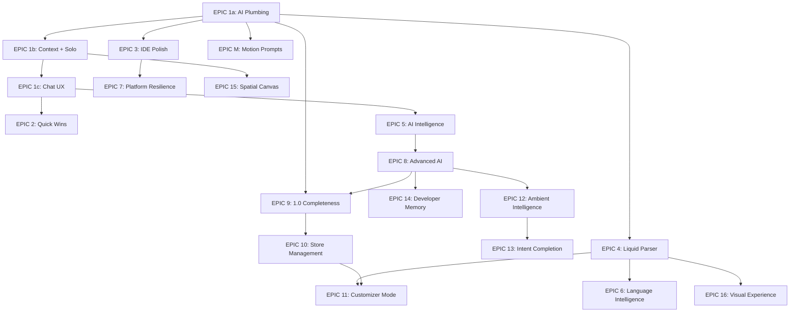

# Synapse EPIC Execution Plan

Master spec reference: [ai_chat_interactivity_blueprint_b967c85f.plan.md](.cursor/plans/ai_chat_interactivity_blueprint_b967c85f.plan.md)

## Critical Decisions (Locked)

- **Preview Bridge**: Same-origin via proxy route (`/api/projects/[projectId]/preview`). PostMessage works freely. Local Liquid renderer is V2 enhancement, NOT launch-critical.
- **Google SDK**: Start with `@google/generative-ai` (AI Studio, API key only) for speed. Upgrade to `@google-cloud/vertexai` (enterprise) for production when rate limits demand it. `AIProviderClient` interface abstracts this.
- **OAuth Scopes**: Two-phase. Phase 1: themes, content, navigation, files, discounts, inventory, products (no Shopify review needed). Phase 2: orders, customers, analytics (protected scopes, requires Shopify app review).
- **Liquid Parser**: Full custom recursive-descent (2-4 week EPIC, foundational dependency)
- **Context Architecture**: New `ContextEngine` replacing both dead `context-builder.ts` and existing `lib/context/`
- **Deploy Pre-flight**: Two-tier -- quick rule-based scan (<2s, every push) + full AI review (on-demand, pre-publish-to-live only)

## Dependency Graph

## Parallel Tracks

EPICs on independent branches can run concurrently:

- **Track A** (AI Pipeline): E1a -> E1b -> E1c -> E5 -> E8 -> E12 -> E13
- **Track B** (Editor/IDE): E1a -> E3 -> E7
- **Track C** (Shopify Integration): E8 -> E9 -> E10 -> E11 (E9 blocked on E8 deploy pre-flight)
- **Track D** (Foundations): E1a -> E4 -> E16
- **Track E** (Language): E1a -> E4 -> E6
- **Track F** (Memory): E8 -> E14
- **Standalone**: EPIC M (anytime after E1b commits to prompts.ts)

---

## EPIC 1a: AI Plumbing

**Goal**: Replace hardcoded single-model architecture with action-based multi-model routing. Add Google Vertex AI as third provider. Enforce 7 architectural principles. Wire preview bridge DOM context into agent pipeline.

**Key files**:

- New: `lib/agents/model-router.ts` (MODEL_MAP, AIAction type, resolveModel)
- New: `lib/agents/providers/google-client.ts` (`@google/generative-ai` SDK, upgradeable to `@google-cloud/vertexai`)
- Modify: `lib/agents/base.ts` (model + action params, `timeoutMs: 120000`, rate limit wait `15000`)
- Modify: `lib/agents/providers/anthropic-client.ts` (default to `claude-sonnet-4-20250514`)
- Modify: `lib/agents/coordinator.ts` (action routing, p0 principles: File Context Rule, Scope Assessment Gate, Verification First-Class, parallel context loading)
- Modify: `app/api/agents/stream/route.ts` (accept `{ action, model, mode, domContext }`)
- Modify: `app/api/agents/execute/route.ts` (accept `domContext`)
- New: `lib/preview/dom-context-formatter.ts` (formatDOMContext for LLM consumption)
- Modify: `components/preview/PreviewPanel.tsx` (forwardRef + getDOMContext)
- Modify: `components/features/agents/AgentPromptPanel.tsx` (getPreviewSnapshot prop, call before send)
- Modify: `app/projects/[projectId]/page.tsx` (wire preview ref to agent panel)
- Modify: `lib/agents/prompts.ts` (PM prompt: DOM context awareness, Discussion Default, Testing Always First)

**Critical decisions baked in**:

- Google SDK V1: `@google/generative-ai` -- needs `GOOGLE_AI_API_KEY` env var (simple API key from AI Studio)
- Google SDK V2 (production): upgrade to `@google-cloud/vertexai` when rate limits demand it (needs `GOOGLE_CLOUD_PROJECT`, `GOOGLE_APPLICATION_CREDENTIALS`)
- Env: add `GOOGLE_AI_API_KEY` to `.env.example` (V1). Add Vertex AI vars as optional.

**Ref plan**: [preview_bridge_agent_wiring_76876338.plan.md](.cursor/plans/preview_bridge_agent_wiring_76876338.plan.md)

**Acceptance criteria**:

- `npm run lint` and `npm run test:run` pass
- Agent stream API accepts `{ action, model, mode, domContext }` in request body
- Google Gemini models respond via `generateResponse()` and `stream()`
- Summary stream uses Haiku (not Opus)
- Coordinator rejects code changes to files not loaded in context (File Context Rule)
- PM returns `needsClarification` for broad/ambiguous requests (Scope Assessment Gate)
- Review agent is mandatory in orchestrated mode (Verification First-Class)
- "Verify this works" chip auto-injected after code_change (Testing Always First)
- Context building uses `Promise.all` (Parallel over Sequential)
- User model preference (from useAgentSettings) passed as `userOverride` to `resolveModel()`, priority: action override > user preference > agent default > system default
- Preview DOM snapshot included in agent context when preview is open (domContext flows through API -> coordinator -> all agents)
- domContext capped at ~3500 tokens via formatter

---

## EPIC 1b: Context Engine + Solo Mode

**Goal**: Replace both dead `context-builder.ts` and existing `lib/context/` with a unified ContextEngine. Add solo PM execution path.

**Key files**:

- New: `lib/ai/context-engine.ts` (file indexing + semantic search + dependency graph + token budgeting)
- Delete: `lib/ai/context-builder.ts` (dead code)
- Modify: `lib/agents/coordinator.ts` (use ContextEngine, add `executeSolo()`)
- Modify: `lib/agents/project-manager.ts` (add `formatSoloPrompt()`)
- New: `hooks/useAgentSettings.ts` (mode + model persistence to localStorage)
- Modify: `lib/agents/prompts.ts` (add SOLO_PM_PROMPT)

**Acceptance criteria**:

- ContextEngine indexes all project files on load (metadata: path, size, type, updated_at)
- Fuzzy file matching: "match the style of my hero" resolves to `sections/hero-banner.liquid`
- Dependency graph auto-includes related files (render/section/asset references)
- Token budget expanded from ~4000 to ~16000 for specialists
- PM output includes `referencedFiles` field, coordinator loads them for specialists
- Solo PM mode generates code changes in one pass without specialists or review
- `useAgentSettings` persists `{ mode: 'orchestrated' | 'solo', model: string }` to localStorage

---

## EPIC 1c: Chat UX Foundation

**Goal**: Upgrade the chat experience with syntax-highlighted code blocks and a Cursor-style input bar. Ship early so all subsequent AI features build on polished UX.

**Key files**:

- New: `components/ai-sidebar/CodeBlock.tsx` (syntax highlighting via Prism/Shiki, line numbers, Copy/Apply/Save actions)
- Modify: `components/ai-sidebar/ChatInterface.tsx` (replace renderMarkdown with CodeBlock renderer, redesign input: file count badge, stop button, review button, model picker dropdown, mode toggle, attachment buttons)
- Modify: `components/features/agents/AgentPromptPanel.tsx` (pass settings, stop handler via abortRef, review handler)
- Modify: `lib/ai/prompt-suggestions.ts` (add `reason` field to Suggestion interface, add code_block and plan detection signals)

**Acceptance criteria**:

- Code blocks in AI responses render with syntax highlighting, line numbers, and Copy/Apply/Save action bar
- Input bar shows: file count badge, Stop button (aborts stream), Review button, model selector dropdown, orchestrated/solo toggle
- Selected editor text auto-included as context when user sends a chat message (selection injection)
- Suggestion chips include a `reason` field (shown in tooltip in EPIC 2)
- Code-block and plan signals detected in AI responses
- Apply action shows inline diff preview; user confirms before write (P4 Verification enforcement)
- Stop button calls `abortRef.current?.abort()` immediately

---

## EPIC 2: Quick Wins

**Goal**: 8 micro-features (15-45 min each) that make the AI feel intentional.

**Key files**:

- Modify: `components/ai-sidebar/ChatInterface.tsx` (thinking label, pin message, copy prompt, session summary)
- Modify: `components/ai-sidebar/SuggestionChips.tsx` (keyboard nav, why tooltip, retry chip)
- Modify: Status bar area in project page (token count)
- Modify: `lib/ai/prompt-suggestions.ts` (reason field, retry-with-context signal)

**Depends on**: EPIC 1c (CodeBlock rendering, suggestion `reason` field, input bar foundation)

**Acceptance criteria**:

- Thinking label shows action-specific text ("Generating schema...", "Reviewing 3 files...")
- Tab/Enter/1-5 keyboard navigation works on suggestion chips
- "Why this suggestion?" tooltip appears on hover
- Short AI responses auto-suggest "Retry with full file context"; AgentPromptPanel detects `[RETRY_WITH_FULL_CONTEXT]` prefix and includes full active file content in request body
- Messages can be pinned and float at top of chat
- Token count shows in status bar
- "Copy as prompt" button on AI responses
- Session summary appears on chat clear

---

## EPIC 3: IDE Polish

**Goal**: All 13 editor improvements that make Synapse feel like a real IDE (plus the already-existing unsaved dot).

**Key files**:

- New: `components/editor/FileBreadcrumb.tsx`, `components/editor/StatusBar.tsx`, `components/editor/CommandPalette.tsx`
- Modify: `components/editor/MonacoEditor.tsx` (schema fold, matching tags, color swatches, double-click object path, right-click find references, schema preview on hover)
- Modify: `components/features/file-management/FileTabs.tsx` + `FileTab.tsx` (drag-reorder)
- Modify: `components/features/file-management/FileExplorer.tsx` (timestamps, snippet count)
- Modify: `hooks/useFileTabs.ts` (reorderTabs, recent files tracking)

**Acceptance criteria** (all 13):

1. File breadcrumb renders above editor with clickable segments (`sections / hero-banner.liquid >  > blocks > image`)
2. Last-edited relative time shows next to files in explorer ("2m ago", "yesterday")
3. Unsaved changes dot -- already exists on `FileTab.tsx` (amber `●`) -- verify working
4. Matching Liquid tag highlights on cursor position (`` -> ``)
5. Schema auto-folds on Liquid file open via `editor.setModelFolding()`
6. Tabs can be drag-reordered (draggable + drop handlers on `FileTabs.tsx`)
7. Ctrl+P opens command palette with "Recent Files" section at top (last 5 with timestamps)
8. Color swatches appear inline for hex/rgb/hsl values (12x12 Monaco inline decoration)
9. Schema setting preview on hover (`"type": "color"` shows mini preview)
10. Snippet usage count badge in FileExplorer (e.g. `price.liquid (x4)` from dependency parser)
11. Double-click selects full Liquid object path via custom `wordSeparators`
12. Paste image offers "Add as asset file" or "Inline as base64"
13. Right-click "Find All References" pre-fills search with selected word/symbol

---

## EPIC 4: Liquid AST Parser (Foundational)

**Goal**: Full recursive-descent Liquid parser producing typed AST nodes with source locations. Foundational for Flow Visualizer, Language Intelligence, and Customizer local renderer.

**Key files**:

- New: `lib/liquid/liquid-ast.ts` (parser + AST node types)
- New: `lib/liquid/ast-walker.ts` (visitor pattern -- replace existing flat walker)
- Modify: `lib/liquid/scope-tracker.ts` (consume AST nodes instead of regex matches)
- Modify: `lib/liquid/type-checker.ts` (walk AST for type inference)

**This is a 2-4 week EPIC.** Build incrementally:

1. Lexer: tokenize Liquid delimiters, strings, identifiers, operators
2. Core nodes: Text, Output, Assign, If/Unless, For, Case
3. Filter chains: `| filter: arg1, arg2` parsing
4. Block tags: Capture, Raw, Comment, Section, Render/Include
5. Schema block: parse `` content as embedded JSON
6. Source locations: every node carries `{ line, column, offset, length }`
7. Error recovery: produce partial AST on malformed input (don't crash)

**Acceptance criteria**:

- Parses all Dawn theme section files without errors
- Every node has accurate source location
- Round-trip: `ast_to_string(parse(source)) ~= source` (whitespace-normalized)
- Existing `LiquidValidator` can be refactored to use AST (doesn't have to be done in this EPIC, just verified as possible)
- `npm run test:run` passes with new parser tests covering edge cases (whitespace trimming, nested blocks, filter chains with string args)

---

## EPIC 5: AI Intelligence (Phases 2-3)

**Goal**: Signal detection, plan mode, quick actions toolbar, output modes, conversation arc tracking, weighted scoring, progressive disclosure, frequency dampening.

**Key files**:

- New: `lib/ai/signal-detector.ts`, `lib/ai/conversation-arc.ts`
- New: `components/ai-sidebar/PlanApprovalModal.tsx`, `components/editor/QuickActionsToolbar.tsx`
- Modify: `lib/ai/prompt-suggestions.ts` (weighted scoring, progressive disclosure, dampening)
- Modify: `lib/ai/action-history.ts` (shownCount/usedCount tracking)
- Modify: `lib/agents/summary-prompt.ts` (mode-aware: chat/plan/review/fix/generate/document)
- Modify: `components/ai-sidebar/ChatInterface.tsx` (output mode rendering per outputMode)
- Modify: `components/editor/MonacoEditor.tsx` (CodeActionProvider for "Fix with AI", onSelectionChange for quick actions)

**Depends on**: EPIC 1c (CodeBlock rendering, suggestion signals, input bar) and EPIC 1b (ContextEngine for full theme awareness)

**Acceptance criteria**:

- `signal-detector.ts` identifies code_block, plan, error, suggestion, refactor signals in AI responses with confidence scores
- Plan mode triggered by `plan` signal shows PlanApprovalModal with numbered steps and Approve/Modify/Cancel
- Quick actions toolbar appears above Monaco selection with Explain/Refactor/Document/Fix
- "Fix with AI" appears as Monaco code action on Liquid diagnostics
- `summary-prompt.ts` SYSTEM_PROMPT adapts output format based on mode (`chat`, `plan`, `review`, `fix`, `generate`, `document`)
- Suggestions use weighted scoring formula (relevance x recency x novelty x escalation)
- Suggestions gate by turn count (simple at turn 1-2, intermediate at turn 3-4, advanced at turn 5+)
- Frequently shown but ignored suggestions are dampened via `shownCount`/`usedCount` tracking in `action-history.ts`

---

## EPIC 6: Language Intelligence

**Goal**: LSP-level Liquid editing features -- 9 capabilities that close the gap with Shopify's LSP and then surpass it with theme-wide awareness.

**Key files**:

- **Prerequisite**: Expand `lib/liquid/shopify-schema.json` from ~128 lines (11 objects) to ~40+ Shopify objects with nested property chains and return types. Source: [Shopify/theme-liquid-docs](https://github.com/Shopify/theme-liquid-docs) repo has machine-readable definitions. ~1-2 day data task.
- New: `lib/monaco/liquid-completion-provider.ts` (object-aware + schema-aware completions)
- New: `lib/monaco/liquid-definition-provider.ts` (Ctrl+Click go-to-definition)
- New: `lib/monaco/linked-editing-provider.ts` (HTML tag auto-rename)
- New: `lib/monaco/translation-provider.ts` (locale key completions)
- New: `lib/liquid/locale-parser.ts` (parse + flatten locale JSON)
- New: `lib/liquid/formatter.ts` (rule-based Liquid formatting -- indent blocks, normalize whitespace)
- New: `lib/liquid/unused-detector.ts` (cross-reference assigns against usage, orphan snippets)
- Modify: `components/editor/MonacoEditor.tsx` (register all new providers -- currently has NO completion or hover providers, only diagnostics and code actions. `onDidType` for auto-close)

**Depends on**: EPIC 4 (AST parser for accurate scope tracking, type inference, and tag matching)

**Acceptance criteria**:

1. Object-aware completions: `{{ product.` offers `.title`, `.price`, `.variants` etc. from `shopify-schema.json`
2. Type-through-assign: `` then `{{ x.` offers Product properties
3. Schema setting completions: `{{ section.settings.` completes with real setting IDs from current file's ``
4. Go to definition: Ctrl+Click on `` navigates to `snippets/price-card.liquid`
5. Translation completions: `{{ '...' | t }}` offers locale keys from `locales/en.default.json`
6. Auto-close Liquid pairs: Typing `` auto-inserts ``
7. Unused variable detection: Unused `` variables show yellow warning squiggles
8. Deprecated tag warnings: `` shows deprecation warning suggesting ``, `| img_tag` flagged
9. HTML auto-rename: Rename `
` auto-renames matching `
` via `linkedEditingRangeProvider`
10. Liquid formatting: Format document indents Liquid blocks, normalizes whitespace, formats schema JSON (rule-based, not Prettier port)

---

## EPIC M: Motion-First AI Generation

**Goal**: Update all 5 agent prompts so AI-generated sections ship with scroll animations, hover micro-interactions, and schema motion controls by default.

**Key files**:

- Modify: `lib/agents/prompts.ts` (all 5 prompts: Liquid, CSS, JS, PM, Review)

**Standalone EPIC** -- no dependencies beyond EPIC 1. Single file change. Can ship anytime.

**Acceptance criteria**:

- AI-generated sections include `data-animate` attributes and IntersectionObserver script
- AI-generated CSS includes `@keyframes`, hover micro-interactions, and `prefers-reduced-motion` media query
- AI-generated schemas include `enable_animations` checkbox and `animation_style` select
- Review agent flags missing motion patterns as warnings

---

## EPIC 7: Platform Resilience

**Goal**: Offline fallback, enhanced keyboard workflow, theme console panel. (Batch undo deferred to EPIC 8. Branching deferred -- needs merge strategy design.)

**Key files**:

- New: `hooks/useOfflineQueue.ts`, `components/editor/ThemeConsole.tsx`, `hooks/useThemeConsole.ts`, `lib/editor/console-stream.ts`, `lib/editor/keyboard-config.ts`
- Modify: `hooks/useAutoSave.ts` (write queue, retry on reconnect)
- Modify: `components/editor/MonacoEditor.tsx` (Ctrl+D, multi-cursor config)
- Modify: `components/editor/SettingsModal.tsx` (keybinding editor in "Keys" tab)

**Depends on**: EPIC 3 (StatusBar for offline indicator, CommandPalette for Ctrl+Shift+P)

**Acceptance criteria**:

- Failed API saves queue to localStorage, flush on reconnect
- StatusBar shows "Offline -- changes saved locally" when disconnected
- Ctrl+D selects next occurrence in Monaco
- Ctrl+Shift+P opens command palette
- Theme console shows diagnostics, push logs, and theme check results in tabbed panel
- Ctrl+backtick toggles console

---

## EPIC 8: Advanced AI (Phase 4)

**Goal**: Multi-modal input, theme-wide review, batch operations, undo safety net, split-diff preview, AI deploy pre-flight.

**Key files**:

- New: `hooks/useApplyWithUndo.ts`, `components/ui/UndoToast.tsx`
- New: `lib/ai/theme-reviewer.ts` (full theme audit), `components/ai-sidebar/ThemeReviewReport.tsx`
- New: `lib/ai/batch-operations.ts` (fix all similar, bulk localization, bulk schema gen)
- Modify: `components/ai-sidebar/ChatInterface.tsx` (image paste/drop, split-diff in code blocks)
- New: `app/api/agents/upload/route.ts` (multi-modal image upload)
- Modify: `app/api/projects/[projectId]/shopify/sync/route.ts` (wire `theme-reviewer.ts` as pre-flight check before push)
- Modify: `components/features/shopify/ShopifyConnectPanel.tsx` (show pre-flight results before deploy)

**Depends on**: EPIC 5 (signal detection for review triggers, output modes for review rendering)

**Acceptance criteria**:

- Paste image into chat -> AI analyzes it with Gemini vision (uses Google client from E1a)
- Theme review scans all files and outputs scored category report via `ThemeReviewReport.tsx`
- "Fix all similar" batch operation works across multiple files
- Apply actions show 10-second undo toast with countdown
- Batch AI operations (multi-file) can be undone as a single unit via `BatchOperation`
- Code blocks in chat show inline split-diff using existing `DiffPreview` component
- Deploy pre-flight (two-tier): (1) Every push runs rule-based quick scan (<2s) checking broken `` references, missing asset files, unclosed tags -- blocks on critical; (2) "Review Theme" button and pre-publish-to-live runs full AI review (30-60s) with scored report

---

## EPIC 9: 1.0 Completeness

**Goal**: 10 features that bridge "code editor" to "theme builder" -- asset management, visual template composition, preview data, collaboration, quality, and content.

**Key files**:

- New (assets): `components/features/assets/AssetBrowserPanel.tsx`, `hooks/useShopifyAssets.ts`, `app/api/stores/[connectionId]/themes/[themeId]/assets/route.ts`
- New (templates): `components/features/templates/TemplateComposer.tsx`, `components/features/templates/SectionSlot.tsx`, `hooks/useTemplateLayout.ts`
- New (preview): `lib/preview/mock-data-provider.ts` (customer, cart, discount mock data)
- New (comments): `components/editor/InlineComments.tsx`, `components/editor/CommentThread.tsx`, `hooks/useCodeComments.ts`, `supabase/migrations/028_code_comments.sql`
- New (deploy): `components/features/shopify/PublishRequestPanel.tsx`, `hooks/usePublishRequests.ts`, `supabase/migrations/029_publish_requests.sql`
- New (metafields): `components/features/content/MetafieldExplorer.tsx`, `components/features/content/MetafieldForm.tsx`, `hooks/useMetafields.ts`, `app/api/stores/[connectionId]/metafields/route.ts`
- New (quality): `lib/quality/theme-performance.ts`, `lib/quality/asset-analyzer.ts`, `lib/quality/image-optimizer.ts`, `lib/quality/a11y-checker.ts`, `components/features/quality/PerformanceDashboard.tsx`, `components/features/quality/A11yPanel.tsx`
- Modify: `components/preview/PreviewControls.tsx` (locale dropdown, mock data dropdown, viewport toggle)
- New: `lib/liquid/locale-parser.ts` (shared with EPIC 6 if built first, or first created here)
- New (image opt UI): `components/features/quality/ImageOptPanel.tsx` (shows optimization recommendations per image)

**Depends on**: EPIC 1a (basic API foundation), EPIC 8 (deploy pre-flight for approval workflow gate)

**Acceptance criteria**:

1. Asset browser shows grid of theme assets (from Shopify `assets/` folder) with upload, delete, and drag-to-insert-reference
2. Template composer shows drag-reorderable section list from `templates/*.json`, plus block reordering within sections
3. Preview supports locale toggle, viewport sizes (375/768/1024/full), and mock customer/cart/discount data presets
4. Inline code comments with threads, stored in Supabase via `code_comments` table, rendered as Monaco gutter icons
5. Role-based deploy: members require admin approval to publish to live theme (via `publish_requests` table + AI pre-flight gate from EPIC 8)
6. Metafield CRUD with type-aware form inputs (text, number, json, date, color, etc.) via `MetafieldExplorer.tsx`
7. Performance dashboard shows 0-100 score with category breakdown (asset weight, render-blocking, image optimization)
8. Image optimization: auto-detect unoptimized images, recommend WebP/srcset/lazy-loading, show size savings
9. A11y scanner flags missing alt, form labels, heading order, link text, color contrast (rule-based, runs on rendered preview)
10. Locale preview toggle works with `locale-parser.ts` to switch language in preview panel

---

## EPIC 10: Store Management

**Goal**: Shopify Admin API integrations -- orders, inventory, navigation, files, discounts, pages, storefront preview. Transform IDE into a store command center.

**Key files**:

- Modify: `lib/shopify/oauth.ts` (Phase 1 scopes: `read_themes`, `write_themes`, `read_content`, `write_content`, `read_online_store_navigation`, `write_online_store_navigation`, `read_discounts`, `write_discounts`, `read_files`, `write_files`, `read_products`, `read_inventory`)
- Modify: `lib/shopify/admin-api.ts` (add `graphql<T>()` method for GraphQL Admin API)
- New: `components/features/store/StoreDataPanel.tsx` (tabbed container in ActivityBar)
- New per function:
  - `OrdersPanel.tsx` + `hooks/useShopifyOrders.ts` + `app/api/stores/[connectionId]/orders/route.ts`
  - `InventoryPanel.tsx` + `hooks/useShopifyInventory.ts` + `app/api/stores/[connectionId]/inventory/route.ts`
  - `NavigationPanel.tsx` + `hooks/useShopifyNavigation.ts` + `app/api/stores/[connectionId]/navigation/route.ts`
  - `FilesPanel.tsx` + `hooks/useShopifyFiles.ts` + `app/api/stores/[connectionId]/files/route.ts`
  - `DiscountsPanel.tsx` + `hooks/useShopifyDiscounts.ts` + `app/api/stores/[connectionId]/discounts/route.ts`
  - `PagesPanel.tsx` + `hooks/useShopifyPages.ts` + `app/api/stores/[connectionId]/pages/route.ts`
- New: `lib/preview/storefront-data-bridge.ts` + `app/api/stores/[connectionId]/storefront/route.ts`

**Two-phase OAuth strategy**: Phase 1 scopes (themes, content, navigation, files, discounts, inventory, products) ship without Shopify review. Phase 2 scopes (`read_orders`, `read_customers`, `read_analytics`) are **protected scopes requiring Shopify app review** -- Orders panel deferred to Phase 2.

**OAuth re-authorization**: Existing connections have only `read_themes/write_themes`. Adding Phase 1 scopes requires re-authorization. Add: detect missing scopes on existing connections, show "Additional permissions needed" banner, redirect to OAuth re-auth flow.

**Acceptance criteria**:

1. OAuth re-authorization flow detects missing scopes and prompts user to re-authorize
2. Navigation editor shows menu items with drag-reorder and "Copy as Liquid" button
3. Files panel (Shopify CDN) lets users browse, upload, and delete files (extends EPIC 9 asset browser)
4. Inventory panel shows variant x location stock matrix with inline edit via GraphQL `inventoryLevels`
5. Discounts panel supports CRUD for price rules and discount codes
6. Pages panel lets users create/edit/delete static pages (About, FAQ, Contact)
7. Storefront API bridge fetches real product data (images, prices, availability) for preview rendering
8. All panels accessible from `StoreDataPanel` tabs in the ActivityBar
9. Orders panel deferred to Phase 2 scopes (requires Shopify app review for `read_orders`)

---

## EPIC 11: Customizer Mode

**Goal**: Full visual theme customizer -- sidebar with section list + settings form + live preview. The feature that makes the tool accessible to designers, not just developers.

**Key files**:

- New: `hooks/useSchemaParser.ts` (parse ``, expose structured data + mutation methods)
- New: `contexts/PreviewSyncContext.tsx` (real-time settings -> preview via postMessage/local render)
- New: `components/features/customizer/CustomizerMode.tsx` (top-level layout replacing editor view)
- New: `components/features/customizer/SectionListSidebar.tsx` (drag-reorder sections from `templates/*.json`)
- New: `components/features/customizer/TemplateSelector.tsx` (switch between index, product, collection templates)
- New: `components/features/customizer/SchemaSettingInput.tsx` (master input for 20+ Shopify setting types: text, color, image_picker, video_url, richtext, font_picker, select, range, checkbox, url, collection, product, article, blog, page, link_list, html, liquid, number, radio)
- New: `components/features/customizer/BlockInstanceManager.tsx` (add/remove/reorder block instances)
- New: `components/features/customizer/SectionHighlighter.tsx` (blue overlay on section hover in preview)
- New: `components/features/customizer/SchemaBuilderInline.tsx` (inline schema editor with validation, dependency rules, auto-generate Liquid)
- New: `components/features/customizer/PresetPanel.tsx` (apply/save/export/import section presets)
- New: `lib/liquid/local-renderer.ts` (**SUBSTANTIAL SUB-PROJECT** -- lightweight Liquid renderer for fast local preview)

**Depends on**: EPIC 4 (AST parser for local renderer -- `local-renderer.ts` walks AST), EPIC 9 (asset browser for `image_picker` setting type), EPIC 10 (navigation data for `link_list` picker)

**Preview strategy** (CORRECTED -- preview is same-origin via proxy):

The preview iframe loads through `/api/projects/[projectId]/preview` which proxies Shopify content and injects `synapse-bridge.js`. This makes it **same-origin**, so postMessage works freely. Two strategies:

- **Server-rendered preview** (V1, default): Push settings to Shopify via Admin API `PUT /themes/{id}/assets` (update `settings_data.json`), then reload the proxied iframe. Latency 2-5s but pixel-perfect Shopify rendering. Works TODAY with existing infrastructure.
- `**local-renderer.ts**` (V2, enhancement): Fast local preview (<200ms) for instant feedback during customizer editing. Scoped to: text interpolation, `section.settings.*`, `block.settings.*`, conditionals, loops, and **~20 essential filters** (upcase, downcase, append, prepend, replace, strip, truncate, size, plus, minus, times, money, img_url, asset_url, default, json, escape, split, join, first). Shopify has ~120+ filters total -- defer the rest. Still a **2-3 week sub-project** but V1 Customizer Mode ships without it.

**Setting type notes**:

- `richtext`: Ship V1 as plain textarea. WYSIWYG editor (TipTap/Lexical) is a V2 enhancement.
- `font_picker`: Use Google Fonts API as V1 substitute. Full Shopify font library parity requires reverse-engineering their proprietary CDN API -- defer.
- `video_url`: URL input + YouTube/Vimeo oEmbed preview. Feasible.
- `image_picker`: Depends on EPIC 9 asset browser for file selection UI.

**Acceptance criteria**:

1. Customizer Mode activates via toolbar button, replaces editor view
2. Section list shows ordered sections from active template JSON with drag-reorder
3. Template selector dropdown switches between `index.json`, `product.json`, `collection.json`, etc.
4. Clicking a section loads its settings into the form panel
5. `SchemaSettingInput` renders correct control for all core types (at minimum: text, color, image_picker, select, range, checkbox, number, url, richtext, font_picker, collection, product)
6. Settings changes update local preview in <200ms via `local-renderer.ts`
7. "Accurate Preview" toggle switches to Shopify iframe (server-rendered)
8. Block instances can be added, removed, and reordered within sections
9. Section highlighter shows blue overlay on hover in preview
10. Schema builder validates duplicate IDs, missing labels, unreferenced settings; "Show this setting only when X is true" dependency rules
11. Preset panel allows applying, saving, and exporting section presets

---

## EPIC 12: Ambient Intelligence (Phase 5)

**Goal**: Proactive nudges that surface actions before the user opens chat.

**Key files**:

- New: `lib/ai/session-intent.ts`, `hooks/useAmbientIntelligence.ts`, `components/ai-sidebar/AmbientBar.tsx`, `lib/ai/nudge-feedback.ts`

**Depends on**: EPIC 8 (theme reviewer for one-click resolutions, diagnostic system)

**Acceptance criteria**:

- Ambient bar shows highest-confidence nudge (e.g., "This section has no schema -- generate one?")
- 6 signal types detected with confidence scoring
- "Yes" triggers one-click resolution, "X" dismisses
- Dismissed signals are dampened via nudge-feedback tracking
- Signals auto-expire after configured timeout

---

## EPIC 13: Intent Completion (Phase 6)

**Goal**: "Don't help me do the task -- do the task while I watch."

**Key files**:

- New: `lib/ai/action-stream.ts`, `lib/ai/workflow-patterns.ts`, `lib/ai/intent-matcher.ts`, `hooks/useIntentCompletion.ts`, `components/ai-sidebar/IntentCompletionPanel.tsx`, `components/ai-sidebar/BatchDiffModal.tsx`

**Depends on**: EPIC 12 (ambient intelligence infrastructure), EPIC 8 (batch undo for Apply All)

**Acceptance criteria**:

- Renaming a section file triggers "Update all references?" with checkbox tree
- "Preview All" opens multi-file diff modal
- "Apply All" uses batch undo (single undo reverts all)
- Workflow patterns cover: rename propagation, section creation, component extraction, locale sync

---

## EPIC 14: Developer Memory (Phase 7)

**Goal**: AI remembers your codebase conventions, decisions, and preferences across sessions.

**Key files**:

- New: `lib/ai/developer-memory.ts`, `lib/ai/convention-detector.ts`, `lib/ai/decision-extractor.ts`, `lib/ai/preference-learner.ts`
- New: `components/features/memory/MemoryPanel.tsx`
- New: `app/api/projects/[projectId]/memory/route.ts`
- New: `supabase/migrations/026_developer_memory.sql`
- Modify: `lib/ai/context-engine.ts` (add Layer 8: developer memory)

**Depends on**: EPIC 1 (ContextEngine), EPIC 8 (decision extraction from agent execution logs)

**Acceptance criteria**:

- Convention detector identifies naming patterns, color approaches, schema patterns with confidence scores
- Memory persists to Supabase and loads on session start
- Layer 8 context injected into all agent prompts
- Memory panel shows conventions/decisions/preferences with Correct/Wrong feedback
- "Forget" button removes a memory entry
- StatusBar shows memory indicator (brain icon + count of active conventions)

---

## EPIC 15: Spatial Canvas (Phase 8)

**Goal**: React Flow graph visualization of theme file dependencies with AI suggestion nodes.

**Key files**:

- New dependency: `@xyflow/react`, `dagre`
- New: `lib/ai/canvas-data-provider.ts`, `components/canvas/CanvasView.tsx`, `components/canvas/FileNode.tsx`, `components/canvas/DependencyEdge.tsx`

**Depends on**: EPIC 1 (ContextEngine for dependency graph data)

**Acceptance criteria**:

- Canvas view accessible via Editor/Canvas/Preview toggle in toolbar
- File nodes show health indicators (diagnostics count, modified status)
- Dependency edges color-coded by type (liquid_include, asset_reference, css_import)
- Auto-layout via dagre, pan/zoom/minimap. For large themes (200+ files): use React Flow node virtualization, cluster by directory (sections/, snippets/, assets/), expand-on-click. Limit initial view to active file's direct dependencies.
- Drop zone at bottom of canvas for ad-hoc file grouping ("Drag files here to create a refactoring context")
- Canvas-specific compact chat input sends only selected/grouped file context (not full sidebar chat)
- AI suggestion nodes float near file clusters, dismissible, feed into nudge-feedback
- All heavy dependencies lazy-loaded (dynamic import)

---

## EPIC 16: Visual Experience (Phases 9-10)

**Goal**: Chromatic IDE (theme-aware ambient colors) + Liquid Flow Visualizer (animated data flow on canvas behind editor).

**Key files**:

- Phase 9: `lib/design-tokens/chromatic-engine.ts`, `components/providers/ChromaticProvider.tsx`, `hooks/useChromaticSettings.ts`
- Phase 10: `lib/liquid/flow-analyzer.ts`, `lib/liquid/flow-graph-builder.ts`, `lib/liquid/particle-system.ts`, `components/editor/FlowCanvas.tsx`

**Depends on**: EPIC 4 (AST parser for flow analysis), EPIC 1 (design tokens for chromatic engine)

**Browser fallback**: oklch -> hsl degradation for browsers without `@property` support.

**Acceptance criteria**:

- Phase 9: IDE tints subtly based on active theme's color palette, 1.2s transitions on project switch, Settings > Appearance tab with intensity slider
- Phase 10: Flow toggle in editor gutter, particles animate along data flow paths at 55+ FPS, hover tooltips show variable values, off-screen culling for large files. **Risk**: Canvas-behind-Monaco scroll sync is the hardest UI challenge in the plan. Build CP4-CP5 (static positioning) first and validate alignment accuracy before investing in particles (CP6-CP7). If scroll sync proves too janky, fall back to side-panel visualization.

---

## Deferred (Needs Design Decisions)

- **Git-style theme branching** (`gap-branching`): Merge algorithm for Liquid files is non-trivial. Start with snapshot branching (switch between complete snapshots, no merge) as V1? Or invest in Liquid-aware merge? Needs `supabase/migrations/027_theme_branches.sql`.
- **Store Management Phase 2 scopes** (orders, customers, redirects, bulk ops, analytics, webhooks): Blocked on Shopify app review for protected scopes (`read_orders`, `read_customers`, `read_analytics`). Orders panel moved here from EPIC 10. Ship after Shopify review approval.

## Change Log (Fixes Applied)

The following 14 issues were identified and resolved in this plan revision:

1. **EPIC 1 split into 1a/1b/1c**: Original EPIC 1 was overloaded (3-4 weeks). Split into: (a) AI Plumbing (model router, Google client, backend perf, principles, preview bridge), (b) Context + Solo Mode, (c) Chat UX Foundation.
2. **p0-principles added to EPIC 1a**: 7 architectural rules (File Context Rule, Scope Assessment Gate, Verification First-Class, Testing Always First, Discussion Default, Parallel over Sequential, Least Invasive Change) now enforced in coordinator.
3. **Preview Bridge Agent Wiring added to EPIC 1a**: From `preview_bridge_agent_wiring_76876338.plan.md` -- dom-context-formatter, PreviewPanel getDOMContext, API domContext passthrough. Was not in any EPIC.
4. **p1-code-blocks moved to EPIC 1c**: Code block rendering (syntax highlighting, Copy/Apply/Save) was too late in EPIC 5. Now ships in 1c alongside input bar redesign.
5. **p1-input-bar fully scoped in EPIC 1c**: Full Cursor-style input redesign (file count, stop, review, model picker, mode toggle, attachments) was incomplete -- only useAgentSettings was covered.
6. **p1-suggestions (enhanced signals) added to EPIC 1c**: `reason` field on suggestions, code_block/plan detection were implicitly merged into EPIC 5. Now explicit in 1c.
7. **EPIC 3 acceptance criteria expanded to 13**: Was listing only 9. Added: schema preview on hover (#9), object path select (#11), paste image handling (#12), unsaved dot verification (#3).
8. **EPIC 5 dependency corrected**: Now depends on EPIC 1c (not just EPIC 1). CodeBlock.tsx removed from EPIC 5 (now in 1c).
9. **EPIC 6 formatting contradiction resolved**: Liquid formatting is now IN EPIC 6 (rule-based, not Prettier port). Removed from Deferred section.
10. **Track B dependency corrected**: EPIC 6 depends on EPIC 4 (not EPIC 3). Track E added for Language pipeline.
11. **EPIC 8 includes deploy pre-flight**: `gap-deploy-preflight` was unassigned. Now wired into EPIC 8 (theme-reviewer.ts runs before push).
12. **EPIC 9 expanded**: Added missing files (`app/api/stores/[connectionId]/metafields/route.ts`, `ImageOptPanel.tsx`), explicit dependency on EPIC 8, numbered acceptance criteria (10 items).
13. **EPIC 10 OAuth scopes fixed**: Added `read_inventory` and `read_products` to Phase 1 scopes. Added Orders panel to acceptance criteria.
14. **EPIC 11 local-renderer flagged as substantial**: `local-renderer.ts` is a 2-3 week sub-project (AST interpreter + 50+ filter implementations + scope management). Build plan detailed in acceptance criteria.

### Round 2 (Final Review vs Master Spec)

1. `**[RETRY_WITH_FULL_CONTEXT]` handler added to EPIC 2**: Master spec (line 674) requires AgentPromptPanel to detect the prefix and load full file content. Was missing from acceptance criteria.
2. **MemoryIndicator added to EPIC 14**: Master spec `p7-memory-ui` specifies a StatusBar brain icon with active convention count. Was missing.
3. **Canvas AI details expanded in EPIC 15**: Drop zone for file grouping and canvas-specific compact chat input were in master spec `p8-canvas-ai` but not in EPIC 15 acceptance criteria.
4. **Apply confirmation added to EPIC 1c**: Master spec P4 Verification principle requires Apply to show inline diff preview before write. EPIC 1c said "writes code to the referenced file" with no confirmation gate.
5. **Selection injection added to EPIC 1c**: Master spec (line 2829) specifies auto-including selected editor text as context. Was missing from input bar spec.
6. **User model override priority added to EPIC 1a**: Master spec `resolveModel()` specifies `action > userOverride > agentDefault > systemDefault`. The user preference passthrough was not explicit.

### Round 3 (Feasibility Audit)

1. **Preview is same-origin (CORRECTED)**: Preview loads via proxy route, making it same-origin. EPIC 11 local renderer downgraded from launch-critical to V2 enhancement. Customizer Mode V1 can ship using server-rendered preview (2-5s latency) without local renderer.
2. **Google SDK switched to AI Studio for V1**: `@google/generative-ai` with `GOOGLE_AI_API_KEY` instead of Vertex AI. Simpler setup, same models. Vertex AI upgrade path preserved via `AIProviderClient` interface.
3. **shopify-schema.json expansion flagged in EPIC 6**: Current schema is 128 lines / 11 objects. Needs ~40+ objects with nested properties. Source: Shopify/theme-liquid-docs repo. ~1-2 day data task added as prerequisite.
4. **Orders panel moved to Deferred**: `read_orders` is a protected Shopify scope requiring app review. Orders removed from EPIC 10 acceptance criteria, moved to Phase 2 scopes.
5. **OAuth re-authorization flow added to EPIC 10**: Existing connections lack new scopes. Added: detect missing scopes, show banner, redirect to re-auth.
6. **richtext/font_picker V1 scoped in EPIC 11**: richtext ships as textarea (WYSIWYG is V2), font_picker uses Google Fonts (Shopify font API parity is deferred).
7. **Deploy pre-flight split into two tiers in EPIC 8**: Quick rule-based scan (<2s) for every push + full AI review (30-60s) on-demand only.
8. **Flow Visualizer scroll sync risk noted in EPIC 16**: Build static rendering first (CP4-5), validate before particles (CP6-7). Side-panel fallback if overlay proves too janky.
9. **React Flow performance strategy added to EPIC 15**: Node virtualization, directory clustering, active-file-focused initial view for large themes.

