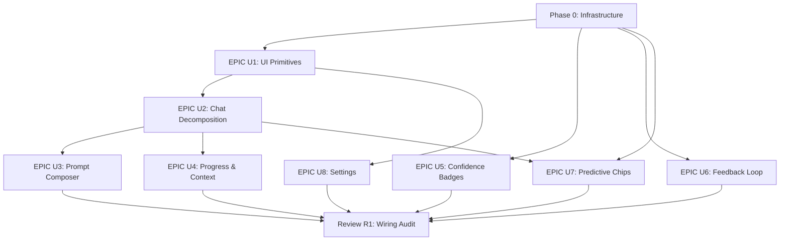

# Synapse UX Overhaul Plan

Continues from the completed EPIC 1-16 execution plan: [synapse_epic_execution_0e0c3b0e.plan.md](.cursor/plans/synapse_epic_execution_0e0c3b0e.plan.md)

## Motivation

EPICs 1-16 built the engine. This plan builds the experience. The identified gaps:

1. No shared UI primitives (every modal/toast/dropdown is bespoke)
2. ChatInterface.tsx is 2,453 lines — a monolith blocking iteration
3. Agent capabilities (confidence, tier routing, pattern learning) are invisible to users
4. No feedback loop — users can't correct the agent and have it learn
5. Prompting is a plain textarea — no slash commands, @mentions, or rich input
6. Post-response experience is passive — no proactive CX suggestions
7. No editor customization, keyboard shortcut discoverability, or export

## Dependency Graph




## Parallel Tracks

- **Track A** (Primitives → Chat): Phase 0 → U1 → U2 → U3 → R1
- **Track B** (Quick Surfaces): Phase 0 → U5 (confidence), U6 (feedback) → R1
- **Track C** (Intelligence): Phase 0 → U7 (predictive chips + CX patterns) → R1
- **Track D** (Settings): U1 → U8 → R1
- **Track E** (Transparency): U2 → U4 → R1

After Phase 0 completes, Tracks A+B+C can run concurrently. All tracks converge at R1.

## Build Order

```
Week 1:    Phase 0 (infrastructure) + U5 (confidence badges, quick win)
Week 2:    U1 (UI primitives) + U6 (feedback loop)
Week 3-4:  U2 (chat decomposition — largest EPIC)
Week 4:    U8 (settings — parallelize with U2 Phase 3-4)
Week 5:    U3 (prompt composer) + U4 (progress & context)
Week 6:    U7 (predictive chips + CX intelligence)
Week 7:    R1 (wiring audit, performance baseline, CX coverage, next-best backlog)
```

## Quick Wins (Ship Before Full EPICs)


| Win                              | From | Effort | Impact                          |
| -------------------------------- | ---- | ------ | ------------------------------- |
| Confidence badge on CodeEditCard | U5   | 1 day  | Builds trust in agent output    |
| Empty state coaching suggestions | U7   | 1 day  | Reduces blank-screen anxiety    |
| Keyboard shortcuts cheatsheet    | U8   | 2 days | Discoverability for power users |
| Thumbs up/down on messages       | U6   | 2 days | Opens feedback data pipeline    |
| Token budget badge               | U4   | 2 days | Reduces surprise context limits |


---

## Phase 0: Infrastructure Foundation

**Goal:** Backend scaffolding that multiple EPICs depend on.

### Database Migrations

```sql
-- Feedback on messages (U6)
ALTER TABLE ai_messages
  ADD COLUMN feedback_rating text CHECK (feedback_rating IN ('thumbs_up', 'thumbs_down')),
  ADD COLUMN feedback_comment text,
  ADD COLUMN feedback_at timestamptz;

-- Per-project settings (U8)
CREATE TABLE project_settings (
  id uuid PRIMARY KEY DEFAULT gen_random_uuid(),
  project_id uuid REFERENCES projects(id) ON DELETE CASCADE NOT NULL,
  category text NOT NULL,          -- 'editor', 'ai_model', 'shortcuts'
  settings jsonb NOT NULL DEFAULT '{}',
  updated_at timestamptz DEFAULT now(),
  UNIQUE(project_id, category)
);

-- Full-text search on messages (U7)
ALTER TABLE ai_messages ADD COLUMN content_tsv tsvector
  GENERATED ALWAYS AS (to_tsvector('english', coalesce(content, ''))) STORED;
CREATE INDEX idx_ai_messages_content_tsv ON ai_messages USING GIN (content_tsv);

-- Theme CX profile cache (U7)
ALTER TABLE projects ADD COLUMN theme_cx_profile jsonb DEFAULT '{}';

-- Dismissed CX patterns (U7)
CREATE TABLE cx_pattern_dismissed (
  id uuid PRIMARY KEY DEFAULT gen_random_uuid(),
  project_id uuid REFERENCES projects(id) ON DELETE CASCADE NOT NULL,
  pattern_id text NOT NULL,
  dismissed_at timestamptz DEFAULT now(),
  UNIQUE(project_id, pattern_id)
);
```

### API Routes

- `POST /api/projects/[projectId]/agent-chat/messages/[messageId]/feedback` — submit/update feedback
- `GET /api/projects/[projectId]/mentions?type=file|plan|memory&q=...` — @mention typeahead
- `GET /api/projects/[projectId]/agent-chat/search?q=...&sessionId=...` — full-text conversation search

### SSE Protocol Extensions

New event types (backward-compatible, ignored by old clients):

- `tool_progress` — emitted *during* tool execution with phase, detail, byte/match counts (U4 Layer 1)
- `context_file_loaded` — emitted when agent reads a file, includes path + token count
- `token_budget_update` — emitted per iteration, includes used/remaining/estimate

### Dependency

- Add `@floating-ui/dom` (~3KB gzipped) for dropdown/tooltip positioning

### Acceptance Criteria

- All migrations applied without errors
- API routes return correct responses with auth checks
- SSE events are emitted by coordinator-v2 and parsed by ChatInterface
- floating-ui installed and importable

---

## EPIC U1: Shared UI Primitive Library

**Goal:** Eliminate ad-hoc modals, toasts, dropdowns, and skeletons. One primitive layer for everything downstream.

**Complexity:** M | **Dependencies:** Phase 0 (floating-ui)

### Components


| Component                 | Key Behavior                                                                                 | Styling                                                               |
| ------------------------- | -------------------------------------------------------------------------------------------- | --------------------------------------------------------------------- |
| `Modal`                   | Focus trap, scroll lock, ESC close, portal render, sizes (sm/md/lg/full)                     | `ide-surface-pop`, `ide-border`, `shadow-2xl`, framer-motion scale-in |
| `ToastProvider` + `Toast` | Queue (max 5), auto-dismiss (pause on hover), swipe-to-dismiss, priority levels              | Fixed top-right `z-50`, `ide-surface-pop`, slide-up                   |
| `Dropdown`                | Keyboard nav (Arrow/Enter/Escape), click-outside, auto-flip via floating-ui, optional search | `ide-surface-pop`, `ide-border`, `shadow-lg`                          |
| `Skeleton`                | 5 variants (text, avatar, card, list, code), shimmer, reduced-motion safe                    | `ide-surface-inset`, `animate-pulse`                                  |
| `Tooltip`                 | Auto-flip, 300ms show delay, disabled on touch, `aria-describedby`                           | `ide-surface-pop`, `text-xs`, `shadow-md`, `z-60`                     |


### Key Files

- `components/ui/Modal.tsx` (new)
- `components/ui/ToastProvider.tsx` + `components/ui/Toast.tsx` (new)
- `components/ui/Dropdown.tsx` (new)
- `components/ui/Skeleton.tsx` (new)
- `components/ui/Tooltip.tsx` (new)
- `lib/ui/positioning.ts` (new — shared floating-ui wrapper)
- `app/layout.tsx` (modify — mount ToastProvider)

### Migrations

Migrate to shared primitives:

- `BatchDiffModal` → uses `Modal`
- `PlanApprovalModal` → uses `Modal`
- `HomeModal` → uses `Modal`
- `DiagnosticsToast` → uses `Toast`
- `FileOperationToast` → uses `Toast`
- `UndoToast` → uses `Toast`

### Acceptance Criteria

- All primitives pass keyboard navigation (Tab, Arrow, Enter, Escape)
- All render correctly in light and dark mode
- All include ARIA roles (dialog, menu, status, tooltip)
- Existing modals and toasts migrated with no visual regression
- ToastProvider mounted in root layout
- Z-index stacking works: modal(40) < toast(50) < tooltip(60)
- All animations respect `prefers-reduced-motion`

### Testing

- Unit: accessibility tests (focus trap, keyboard nav, ARIA)
- Visual: snapshot tests for light/dark variants
- Integration: stacking tests (modal + toast + tooltip simultaneously)

---

## EPIC U2: ChatInterface State Extraction & Decomposition

**Goal:** Reduce ChatInterface.tsx from 2,453 lines to <500 by extracting state into hooks and UI into composable components. Consolidate the dual rendering paths.

**Complexity:** XL | **Dependencies:** U1 (Modal patterns for ContextDrawer)

### Phase 1: Extract State Hooks


| Hook                 | Responsibility                                                 |
| -------------------- | -------------------------------------------------------------- |
| `useChatInput`       | Input value, draft persistence (localStorage), submit handling |
| `useChatScroll`      | Auto-scroll, scroll-to-bottom detection, scroll position       |
| `useChatActions`     | Edit, regenerate, fork, pin/unpin, truncate                    |
| `useChatAttachments` | Image/file upload state, drag-drop, paste handling             |
| `useChatMentions`    | @mention parsing, plan mention resolution, typeahead state     |


### Phase 2: Extract UI Components


| Component            | Purpose                                                   |
| -------------------- | --------------------------------------------------------- |
| `MessageList.tsx`    | Scrollable message container, date headers, pinned banner |
| `MessageBubble.tsx`  | Single message with role-based styling                    |
| `ChatInput.tsx`      | Textarea + controls (mode, model, send, context meter)    |
| `ChatHeader.tsx`     | Session title, share, settings                            |
| `MessageActions.tsx` | Per-message actions (edit, copy, pin, regenerate)         |


### Phase 3: Consolidate Rendering

- Merge legacy (`thinkingSteps` + `content`) and block-based (`blocks[]`) into single `MessageRenderer.tsx`
- All messages normalize to blocks internally
- Remove legacy rendering conditionals entirely

### Phase 4: ContextDrawer

- Slide-in panel from right (`w-80`, `ide-surface-panel`, `border-l ide-border`)
- Shows: loaded files with token counts, context sources, pin/unpin
- Triggered from context meter click or keyboard shortcut

### Key Files

- 5 new hooks in `hooks/`
- 6+ new components in `components/ai-sidebar/`
- `ChatInterface.tsx` refactored to orchestration shell

### Acceptance Criteria

- ChatInterface.tsx < 500 lines
- All extracted hooks independently testable
- No rendering path branches for legacy vs. block-based
- No visual regression in existing chat behavior
- Error boundaries on all extracted components
- 500+ messages render without jank

### Testing

- Unit: each extracted hook in isolation
- Integration: full message flow (send → stream → render → actions)
- Regression: screenshot comparison of existing chat states

---

## EPIC U3: Rich Prompt Composer

**Goal:** Upgrade the plain textarea into a structured composer with slash commands, @mentions, and template integration.

**Complexity:** L | **Dependencies:** U2 (ChatInput extraction), Phase 0 (@mention API)

### Features

1. **Slash Commands** — type `/` triggers `Dropdown` (from U1) with: `/fix`, `/explain`, `/plan`, `/test`, `/debug`, `/review`. Each sets mode + pre-fills context. Registry pattern (extensible, not hardcoded switch).
2. **@Mention Autocomplete** — type `@` triggers typeahead for files, plans, memories. Extends existing `PlanMentionPopover`. Results from `mentions` API. Uses `Dropdown` with search filter.
3. **Code Snippet Embedding** — select code in editor → toolbar button "Ask about this" → inserts fenced code block with file path + line numbers into prompt textarea.
4. **Multiline Auto-Resize** — grows to 10 lines, then scrolls. Shift+Enter for newline. Enter to send.
5. **Template Quick-Access** — small button in input bar opens existing `PromptTemplateLibrary`. Recently-used shown as subtle chips.

### Key Files

- `components/ai-sidebar/PromptComposer.tsx` (new — wraps ChatInput)
- `components/ai-sidebar/SlashCommandMenu.tsx` (new)
- `components/ai-sidebar/MentionMenu.tsx` (new)
- `lib/ai/slash-commands.ts` (new — command registry)
- `lib/ai/mention-resolver.ts` (new — resolves @mentions to context payloads)
- `hooks/useSlashCommands.ts` (new)

### Acceptance Criteria

- Slash popover appears on `/` within 100ms
- @mentions show results within 200ms
- Code embedding preserves file path and line numbers
- Draft persists across page navigation (localStorage)
- All popovers keyboard-accessible (Arrow, Enter, Escape)
- Commands are extensible via registry pattern

### Testing

- Unit: slash command parsing, mention resolution
- Integration: composer + ChatInterface message flow
- Edge cases: nested @mentions, incomplete slash commands, paste-over-mention

---

## EPIC U4: Always-Streaming Activity & Context Transparency

**Goal:** Eliminate every dead zone. The user should always see something happening — file reads streaming content, code writes showing diffs line-by-line, searches revealing matches as they're found, reasoning flowing token-by-token. No moment where the agent is working but the UI is silent.

**Complexity:** L (upgraded from M) | **Dependencies:** U2 (ContextDrawer, ToolActionItem refactor), Phase 0 (SSE events)

### The Problem

Currently ~40% of agent activity is invisible. The coordinator emits `tool_start` → executes tool synchronously → emits `tool_call` with final result. Between start and done, the UI shows a spinner. For tool calls that take 1-5 seconds (large file reads, multi-file searches, complex code generation), this creates dead zones where the user wonders if anything is happening.

### Layer 1: Coordinator Event Enrichment (Backend)

Add a new SSE event type `tool_progress` emitted *during* tool execution, not just at start/end:

```typescript
interface ToolProgressEvent {
  type: 'tool_progress';
  toolCallId: string;
  name: string;            // 'read_file', 'search_replace', 'grep_content', etc.
  progress: {
    phase: string;         // 'reading', 'writing', 'searching', 'applying'
    detail: string;        // 'sections/header.liquid (2.4KB)', 'Match 3 of 7'
    bytesProcessed?: number;
    totalBytes?: number;
    matchCount?: number;
    lineNumber?: number;
    percentage?: number;   // 0-100 when total is known
  };
}
```

**Tool-specific streaming:**


| Tool                  | What to stream                                                          | Events                                                   |
| --------------------- | ----------------------------------------------------------------------- | -------------------------------------------------------- |
| `read_file`           | File path → size → content chunks (first 10 lines, then "..." if large) | `tool_progress` with file metadata, then content preview |
| `search_replace`      | File path → searching... → match found at line N → applying replacement | `tool_progress` per phase                                |
| `create_file`         | File path → writing N lines → done                                      | `tool_progress` with line count                          |
| `grep_content`        | Searching N files → match in file A (line X) → match in file B (line Y) | `tool_progress` per match found                          |
| `list_files`          | Scanning directory → N files found                                      | `tool_progress` with count                               |
| `read_multiple_files` | Reading file 1 of N → file 2 of N → ...                                 | `tool_progress` per file                                 |
| `theme_check`         | Running check 1 of N → finding in file A → ...                          | `tool_progress` per check                                |


**Implementation approach:** Wrap each tool's execution with a progress callback:

```typescript
const toolResult = await executeV2Tool(toolCall, {
  ...v2ToolCtx,
  onProgress: (progress) => {
    onToolEvent?.({ type: 'tool_progress', toolCallId: toolCall.id, name: toolCall.name, progress });
  }
});
```

### Layer 2: Live Activity Feed (Frontend)

Redesign `ToolActionItem.tsx` from binary (loading/done) to streaming:

**During execution (between `tool_start` and `tool_call`):**

```
┌──────────────────────────────────────────┐
│ 📖 Reading sections/header.liquid        │
│ ░░░░░░░░░░░░░░░░░░░░░░░░░ 2.4KB        │  ← progress bar (when total known)
│ <header class="site-header" ...          │  ← content preview (first few lines)
│ ...                                      │
└──────────────────────────────────────────┘
```

```
┌──────────────────────────────────────────┐
│ 🔍 Searching 47 files for ".product-card"│
│ ▸ sections/collection.liquid:34          │  ← matches stream in as found
│ ▸ snippets/product-card.liquid:12        │
│ ▸ assets/product.css:89                  │
│   3 matches found...                     │
└──────────────────────────────────────────┘
```

```
┌──────────────────────────────────────────┐
│ ✏️ Editing sections/header.liquid         │
│   Line 34: applying replacement...       │  ← shows which line is being changed
│ - <div class="old-class">               │  ← mini inline diff
│ + <div class="new-class">               │
└──────────────────────────────────────────┘
```

**Visual treatment:**

- Same compact collapsible card as current `ToolActionItem`, but content updates in real-time
- Progress bar: thin 2px bar at top of card, `bg-sky-400`, animates left-to-right
- Content preview: `font-mono text-xs ide-text-muted`, max 3-4 lines, auto-scrolls
- When tool completes: progress bar fills to 100%, content freezes, card collapses to one-line summary
- Collapse animation: 200ms ease-out

**What this replaces:** The current spinner-only state between `tool_start` and `tool_call`. Every tool call now has visible activity from the moment it starts.

### Layer 3: Streaming Code Generation

When the LLM is generating a tool call (e.g., composing the `new_str` argument for `search_replace`), the tokens arrive sequentially but are currently buffered until the full tool call JSON is complete. Instead:

- **Stream the reasoning text** that accompanies tool calls (already works via `reasoning` events)
- **Show a "composing edit..." indicator** on the target file while the tool call is being assembled
- When the full tool call arrives and execution starts, transition to the Layer 2 progress view

This bridges the gap between "reasoning" and "tool_start" — the moment where the LLM is writing code but the UI doesn't show it yet.

### Layer 4: Context & Budget Transparency (Original U4 Features)

These remain from the original spec:

1. **Summary Typing Indicator** — default shows what the agent is doing: "Reading `header.liquid`...", "Comparing approaches...", "Writing CSS...". Now powered by the richer `tool_progress` events (not just `thinking` events). Expandable to full reasoning.
2. **Context Transparency Drawer** — from U2 Phase 4. Files loaded with token counts, pin/unpin, context sources. Now also shows files *as they're being read* (from Layer 2 streaming).
3. **Token Budget Badge** — `~X turns remaining`, warning at 80%, critical at 95%.
4. **Interactive ProgressRail** — click phase for details, hover for description, error phases show message.

### Key Files

**Backend (coordinator + tools):**

- `lib/agents/coordinator-v2.ts` (modify — add `onProgress` callback to tool execution)
- `lib/agents/tools/v2-tools.ts` or equivalent (modify — emit progress events per tool)
- `app/api/agents/stream/v2/route.ts` (modify — handle `tool_progress` SSE event type)

**Frontend (UI components):**

- `components/ai-sidebar/ToolActionItem.tsx` (modify — major: streaming content, progress bar, mini diff)
- `components/ai-sidebar/ToolProgressBar.tsx` (new — thin progress bar component)
- `components/ai-sidebar/ToolContentPreview.tsx` (new — streaming content preview)
- `components/ai-sidebar/ComposingIndicator.tsx` (new — "composing edit..." bridge state)
- `components/ai-sidebar/EnhancedTypingIndicator.tsx` (new — powered by tool_progress events)
- `components/ai-sidebar/TokenBudgetBadge.tsx` (new)
- `components/ai-sidebar/ProgressRail.tsx` (modify — add interactivity)
- `hooks/useTokenBudget.ts` (new)
- `hooks/useToolProgress.ts` (new — manages streaming tool state)

### Acceptance Criteria

- **Zero dead zones:** no period longer than 500ms where the agent is working but UI shows only a spinner
- `tool_progress` events emitted for all 7 major tool types (read, write, create, search, grep, list, check)
- File reads show content preview (first 3-4 lines) while reading
- Searches show matches incrementally as found
- Code edits show mini inline diff during application
- Progress bar visible on every tool call card
- "Composing edit..." indicator bridges reasoning → tool_start gap
- Typing indicator updates from `tool_progress` events (not just `thinking`)
- Context drawer shows files as they're being loaded (real-time)
- Token budget within ±25% of actual
- ProgressRail phases clickable with detail popover
- All animations respect `prefers-reduced-motion`
- SSE overhead from `tool_progress` events < 10% increase in stream size (events are small, ~100 bytes each)

### Testing

- Integration: verify `tool_progress` events flow from coordinator → SSE → UI for each tool type
- Performance: measure SSE throughput with progress events enabled (should not bottleneck)
- Visual: screenshot tests for each tool type's streaming state (reading, searching, editing)
- Edge cases: tool fails mid-stream, SSE connection drops during progress, rapid tool succession

---

## EPIC U5: Confidence-Aware Code Application

**Goal:** Surface existing confidence scores as informational hints. Single code path — advisory, never blocking.

**Complexity:** S | **Dependencies:** Phase 0 (pipeline verification)

### Phases

1. **Pipeline verification** — ensure `CodeChange.confidence` is populated by coordinator-v2, flows through SSE `change_preview` events, arrives at UI components. Add fallback: undefined → no badge. Clamp [0, 1] at ingestion.
2. **Badge display** — enhance existing `ConfidenceBadge.tsx`. Place on `CodeEditCard`, `FileCreateCard`, `PlanCard`. Colors: green (≥0.8) `bg-[#28CD56]/20`, amber (0.6–0.79) `bg-amber-500/20`, stone (<0.6) `bg-stone-500/20`.
3. **Review hint** — low confidence (<0.6): subtle "Review recommended" text below diff. Not a gate. Tooltip with brief explanation.

### Key Files

- `components/ui/ConfidenceBadge.tsx` (modify)
- `components/ai-sidebar/CodeEditCard.tsx` (modify)
- `components/ai-sidebar/FileCreateCard.tsx` (modify)
- `components/ai-sidebar/PlanCard.tsx` (modify)
- `lib/agents/confidence-flow.ts` (new — pipeline verification + clamping)

### Acceptance Criteria

- Badge renders on all code change cards when confidence is defined
- No badge when confidence is undefined (graceful degradation)
- Badge colors match design system (green/amber/stone)
- "Review recommended" for confidence < 0.6
- Single code path — no branching on confidence for apply behavior

---

## EPIC U6: Feedback Loop (Core)

**Goal:** Let users tell the agent what went wrong. Two mechanisms, not six.

**Complexity:** M | **Dependencies:** Phase 0 (DB migration, API route)

### Features

1. **Thumbs Up/Down** — persistent buttons below every assistant message (not hover-only). Stores in DB. Overwrite on change. Optional comment field expands on thumbs-down.
2. **Inline Correction** — on reject of a code edit, text field: "What should it do instead?" Sends new message with `correction_ref` to original. Agent sees correction context.
3. **Memory Integration** — thumbs-down + comment auto-creates `developer_memory` entry tagged `feedback`. Visible in MemoryPanel with "Feedback" filter.

### Key Files

- `components/ai-sidebar/MessageFeedback.tsx` (new)
- `components/ai-sidebar/InlineCorrection.tsx` (new)
- `app/api/projects/[projectId]/agent-chat/messages/[messageId]/feedback/route.ts` (new)
- `hooks/useMemory.ts` (modify — feedback integration)
- `lib/agents/pattern-learning.ts` (modify — weight corrections)

### Acceptance Criteria

- Thumbs buttons visible on every assistant message (persistent, not hover)
- Feedback persists to DB, survives page refresh
- Inline correction creates message with reference to original
- Thumbs-down + comment creates developer_memory entry
- Feedback entries visible in MemoryPanel with filter
- Rate limiting: max 1 feedback per message (overwrite)

### UI Spec

```
Feedback buttons: below message, right-aligned
  - Size: w-7 h-7, rounded-md
  - Default: ide-text-muted, ide-hover on hover
  - Active positive: bg-[#28CD56]/10, text-[#28CD56]
  - Active negative: bg-red-500/10, text-red-400
  - Animation: scale-95 → scale-100 on click
```

---

## EPIC U7: Predictive Action Chips & Session Intelligence

**Goal:** After every response, surface subtle chips above the input that suggest what to do next — including proactive CX improvements for the Shopify store.

**Complexity:** L | **Dependencies:** U2 (MessageList), Phase 0 (DB, search index)

### Predictive Chips

#### Three chip categories, always mixed:


| Category       | Color Dot        | Source                 | Example (after editing product template)                                 |
| -------------- | ---------------- | ---------------------- | ------------------------------------------------------------------------ |
| **Completion** | `bg-sky-400`     | What was just done     | "Test in preview", "Push to Shopify"                                     |
| **Neighbor**   | `bg-purple-400`  | Related files/sections | "Add product reviews section", "Optimize variant selector"               |
| **CX Insight** | `bg-emerald-400` | Theme gap analysis     | "Add trust badges below add-to-cart", "Add sticky add-to-cart on scroll" |


#### Placement & Visual Design

```
┌─────────────────────────────────────┐
│  Message stream (scrollable)        │
│  ...                                │
│  [Last assistant message]           │
│                                     │
├─────────────────────────────────────┤
│ ● Add trust badges  ● Sticky cart  │  ← chips row
├─────────────────────────────────────┤
│ Ask anything...                  ⏎  │  ← input textarea
└─────────────────────────────────────┘
```

- **Position:** Inside input container, directly above textarea. Not in message stream.
- **Size:** `text-xs` (12px), `px-2.5 py-1`, `rounded-full` — compact pills
- **Background:** `ide-surface-input` / dark: `bg-white/5`
- **Border:** `ide-border` (1px) / dark: `border-white/10`
- **Text:** `ide-text-muted` / dark: `text-gray-400`
- **Hover:** `ide-hover` background, `ide-text-2` text — subtle, not dramatic
- **Category dot:** 4px circle inline before label
- **No shadows, no elevation** — flat, inline suggestions
- **Layout:** `overflow-x-auto` horizontal scroll, `scrollbar-width: none`, gradient fade on edges
- **Max 5 chips**, scroll for overflow
- **Appear:** fade-in 200ms, stagger 30ms per chip — after response completes
- **Disappear:** fade out 100ms when user starts typing
- **Reappear** when input is cleared
- **Click:** inserts prompt text into textarea (does NOT auto-send — user edits first)
- **Hover tooltip** (shared `Tooltip` from U1): one-line description + impact level + files affected

#### CX Pattern Library

`lib/ai/cx-patterns.ts` — structured knowledge base of 50+ Shopify CX patterns:

```typescript
interface CXPattern {
  id: string;
  category: 'trust' | 'urgency' | 'social-proof' | 'navigation' | 'product' |
            'cart' | 'checkout' | 'mobile' | 'search' | 'personalization';
  name: string;
  impact: 'high' | 'medium' | 'low';
  description: string;
  relatedFiles: string[];       // Theme files this touches
  relatedSections: string[];    // Section types this relates to
  detectionPattern: string;     // Regex/selector to check if it exists
  promptTemplate: string;       // What to insert into the textarea on click
}
```

**Categories:**

- **Trust:** badges, secure checkout icons, return policy, payment icons, reviews
- **Urgency:** stock counters, countdown timers, "X people viewing"
- **Social proof:** review widgets, bestseller badges, recently purchased, Instagram
- **Navigation:** predictive search, mega menus, breadcrumbs, sticky header, back-to-top
- **Product:** sticky add-to-cart, size guides, variant swatches, zoom, video, bundles
- **Cart:** cart drawer, free shipping bar, upsell recommendations, saved items
- **Mobile:** thumb-friendly CTAs, swipeable galleries, mobile nav, tap-to-expand
- **Search:** predictive search, filter counts, collection sorting, "you may also like"
- **Personalization:** recently viewed, wishlist, personalized recommendations

#### Theme Gap Detector

`lib/ai/theme-gap-detector.ts` — scans theme files against CX pattern library:

- Runs on project load and after each Shopify push
- Checks each pattern's `detectionPattern` against theme files
- Caches results in `projects.theme_cx_profile` (JSONB)
- Returns `{ present: CXPattern[], missing: CXPattern[], partial: CXPattern[] }`

#### Chip Generation Engine

`lib/ai/next-steps-generator.ts` — produces ranked chips after each response:

**Inputs:**

- Last response content (what was done)
- Files touched in this turn
- Current theme CX profile (what's missing)
- Dismissed patterns (from `cx_pattern_dismissed`)
- Recent chip history (dampening — same pattern not shown twice in 10 turns)

**Scoring:**

- Proximity (1.0) — patterns touching same files/sections as just-completed work
- Absence (0.9) — patterns missing from theme (from gap detector)
- Impact (0.8) — high > medium > low
- Recency (0.6) — not recently suggested
- Category diversity (0.5) — always mix completion + neighbor + CX, never all one type

**Output:** Top 5 chips, guaranteed at least 1 from each category when applicable.

### Session Intelligence

#### Session Summary Card

- Auto-generated after sessions with 10+ messages
- Shows: files changed, lines added/removed, patterns learned, time elapsed
- Collapsible card in `SessionSidebar`

#### Global Undo Stack

- Track last 20 applied changes per session (in-memory, cleared on refresh)
- Undo button in chat header, hover shows action description
- Uses shared `Toast` from U1 for undo confirmation
- Extends existing `useApplyWithUndo` to session level

#### Conversation Search

- Search bar in `SessionSidebar` header
- Full-text via `tsvector` index (from Phase 0)
- Debounced input (300ms), paginated results
- Click to jump to message, highlight matches

#### Empty State Coaching

- When chat is empty, show 3 suggestions based on:
  - Current open file (file-specific prompts)
  - Theme CX profile (missing high-impact patterns)
  - Project state (new project → onboarding prompts)
- Refreshes on file change

### Key Files

- `lib/ai/cx-patterns.ts` (new — CX pattern knowledge base)
- `lib/ai/next-steps-generator.ts` (new — chip generation engine)
- `lib/ai/theme-gap-detector.ts` (new — theme scan against patterns)
- `lib/ai/prompt-suggestions.ts` (modify — integrate next-steps generator)
- `components/ai-sidebar/NextStepChips.tsx` (new — subtle chip row above input)
- `components/ai-sidebar/ChipTooltip.tsx` (new — hover detail)
- `components/ai-sidebar/SessionSummary.tsx` (new)
- `components/ai-sidebar/GlobalUndo.tsx` (new)
- `components/ai-sidebar/ConversationSearch.tsx` (new)
- `components/ai-sidebar/EmptyStateCoaching.tsx` (new)
- `hooks/useThemeGapProfile.ts` (new)
- `hooks/useUndoStack.ts` (new)
- `hooks/useConversationSearch.ts` (new)
- `components/ai-sidebar/SessionSidebar.tsx` (modify — add search, summary)

### Acceptance Criteria

- Chips appear within 500ms of response completion
- At least 1 CX insight chip when agent touched template/section files
- CX patterns detected as absent/present with >80% accuracy
- Click inserts prompt into textarea (does NOT auto-send)
- Tooltip shows impact + affected files
- Dampening: same pattern not shown twice in 10 turns
- Theme gap profile updates after each Shopify push
- Chips fade out when user types, reappear when input is cleared
- Conversation search returns results within 300ms (<1000 messages)
- Global undo supports last 20 operations
- Empty state shows file-aware CX suggestions

---

## EPIC U8: Settings & Keyboard Shortcuts

**Goal:** User control over editing environment and effortless discoverability.

**Complexity:** M | **Dependencies:** U1 (Modal for cheatsheet)

### Features

1. **Editor Preferences** — new "Editor" tab in existing `SettingsModal`: font size (12–24px), font family (3 monospace options), tab size (2/4), word wrap toggle, line numbers toggle. Persists to `project_settings` table.
2. **Keyboard Shortcuts Cheatsheet** — Cmd+/ opens modal. Grouped by category (Navigation, Editing, AI, Files). Searchable. Visual key badges (`ide-surface-input border ide-border rounded text-xs font-mono`).
3. **AI Model Preferences** — new "AI" tab: default model per project, temperature slider (0–1). Persists to `project_settings`.
4. **Conversation Export** — button in SessionSidebar context menu. Formats: Markdown (default), JSON. Includes timestamps, code blocks, metadata. Streaming download for large conversations.

### Key Files

- `components/editor/SettingsModal.tsx` (modify — add tabs)
- `components/editor/EditorPreferences.tsx` (new)
- `components/editor/KeyboardCheatsheet.tsx` (new)
- `components/editor/AIModelSettings.tsx` (new)
- `components/ai-sidebar/ConversationExport.tsx` (new)
- `lib/export/conversation-exporter.ts` (new)

### Acceptance Criteria

- Preferences apply immediately without refresh
- Cheatsheet opens with Cmd+/, searchable
- AI model preferences persist per project
- Markdown export produces valid formatting with code blocks
- Large export (1000+ messages) doesn't freeze UI

---

## Review R1: Wiring Audit & Next-Best Enhancements

**Goal:** After all 8 EPICs ship, run a structured review that verifies everything is wired end-to-end, identifies loose ends, and produces a ranked list of next-best feature enhancements and augmentations.

**Trigger:** All EPICs U1–U8 marked completed. This is not optional — it runs before declaring the overhaul done.

**Complexity:** M | **Dependencies:** All EPICs complete

### Audit 1: Cross-EPIC Data Flow Verification

Trace every data path that crosses EPIC boundaries. For each, verify the handoff works in production:


| Data Flow               | Source → Destination                                                  | What to verify                                                                   |
| ----------------------- | --------------------------------------------------------------------- | -------------------------------------------------------------------------------- |
| Tool progress streaming | tool execution → onProgress → SSE tool_progress → ToolActionItem (U4) | Every tool type emits progress, UI shows streaming content, no dead zones >500ms |
| Confidence pipeline     | coordinator-v2 → SSE → CodeEditCard (U5) → feedback (U6)              | Score arrives at UI, badge renders, feedback references correct message          |
| Feedback → Memory       | MessageFeedback (U6) → API → developer_memory → pattern-learning      | Thumbs-down + comment creates memory entry, agent sees it next session           |
| CX patterns → Chips     | theme-gap-detector (U7) → next-steps-generator → NextStepChips        | Gap scan runs, chips reflect actual theme state, click pre-fills correct prompt  |
| Context pinning         | ContextDrawer (U4) → next agent turn context assembly                 | Pinned files actually appear in agent context on the next turn                   |
| Token budget            | SSE token_budget_update → TokenBudgetBadge (U4) → ContextMeter        | Budget updates in real-time, warning/critical thresholds trigger correctly       |
| Slash commands → Mode   | SlashCommandMenu (U3) → mode switch → agent routing                   | `/plan` sets plan mode, `/debug` sets debug mode, agent receives correct mode    |
| @mentions → Context     | MentionMenu (U3) → mention-resolver → agent context payload           | Mentioned file/plan/memory content injected into agent context                   |
| Settings → Editor       | SettingsModal (U8) → project_settings DB → editor rendering           | Font size, tab size, word wrap apply immediately across all panels               |
| Search → Messages       | ConversationSearch (U7) → tsvector index → MessageList scroll         | Search finds messages, click scrolls to correct position, highlights match       |
| Undo stack → Files      | GlobalUndo (U7) → file system → toast confirmation                    | Undo reverts correct file content, toast shows what was undone                   |


**Deliverable:** A pass/fail matrix. Any failure becomes a fix task before close-out.

### Audit 2: UX Walkthrough (Every User Path)

Walk through every primary user path end-to-end. For each, check the experience is coherent — no dead ends, no missing states, no broken transitions:

1. **New user, empty project** → empty state coaching → click CX chip → prompt pre-fills → send → response → next-step chips → click neighbor chip → iterate
2. **Returning user, existing session** → session list → search old conversation → find message → continue conversation → feedback on old response
3. **Code edit flow** → prompt → agent streams → thinking indicator → code edit card with confidence badge → review diff → apply → undo → re-apply
4. **Plan flow** → `/plan` slash command → agent creates plan → plan card → approve → build → session summary
5. **Feedback flow** → thumbs-down → comment → inline correction → agent retries → thumbs-up → verify memory entry created
6. **Context management** → open context drawer → see loaded files → pin a file → unpin another → send message → verify agent used pinned file
7. **Settings flow** → Cmd+, → change font size → see immediate update → change AI model → send prompt → verify correct model used
8. **Export flow** → session context menu → export markdown → verify formatting → export JSON → verify structure
9. **Keyboard-only flow** → navigate entirely with keyboard: Tab to input → `/` for commands → Arrow to select → Enter → Arrow to chip → Enter → Escape

**Deliverable:** A checklist with pass/fail per path. Any broken path becomes a fix task.

### Audit 3: Performance Baseline

Measure and record baselines so future changes can be compared:


| Metric                               | Target                       | How to measure                                    |
| ------------------------------------ | ---------------------------- | ------------------------------------------------- |
| Bundle size delta (vs. pre-overhaul) | < +50KB gzipped              | `next build` output, compare main chunk sizes     |
| Chat render time (100 messages)      | < 200ms                      | React DevTools Profiler, measure initial mount    |
| Chat render time (500 messages)      | < 500ms                      | Same, with virtualization if U2 added it          |
| Chip generation latency              | < 500ms after response       | Performance.now() around next-steps-generator     |
| Theme gap scan time                  | < 5s for 100-file theme      | Performance.now() around theme-gap-detector       |
| @mention typeahead latency           | < 200ms                      | Network tab, measure API response time            |
| Conversation search latency          | < 300ms for 1000 messages    | Network tab, measure API response time            |
| SSE overhead from new events         | < 5% increase in stream size | Compare stream byte count with/without new events |


**Deliverable:** A performance report with measured values. Any metric exceeding target becomes an optimization task.

### Audit 4: Dead Code & Orphan Cleanup

After decomposing ChatInterface (U2) and migrating modals/toasts (U1), check for:

- Unused imports in `ChatInterface.tsx` (should be drastically reduced)
- Legacy rendering code that should have been removed in U2 Phase 3
- Old modal/toast components that are now fully migrated and can be deleted
- Unused CSS classes in `globals.css` or `polish.css` from removed components
- Feature flags that were temporary and can be removed
- Duplicate type definitions that emerged from extraction

**Deliverable:** A cleanup PR removing all identified dead code.

### Audit 5: CX Pattern Coverage & Gap Analysis

After U7 ships with the initial 50+ CX patterns, analyze:

1. **Coverage by category** — which categories have strong coverage, which are thin?
2. **Detection accuracy** — sample 20 patterns against 5 real Shopify themes. How many are correctly detected as present/absent?
3. **Chip click-through rate** — if analytics are wired, which chip categories get clicked most? Which are ignored?
4. **Missing patterns** — based on competitor analysis (Shopify Dawn theme, top Shopify themes on ThemeForest), what patterns are we not suggesting?
5. **Prompt quality** — for 10 clicked chips, does the pre-filled prompt produce good agent output? Or does it need refinement?

**Deliverable:** Updated `cx-patterns.ts` with gaps filled, detection patterns refined, and prompt templates improved.

### Audit 6: Next-Best Feature Enhancements (Ranked)

Based on everything learned from Audits 1–5, produce a ranked list of next-best enhancements. Score each on:

- **User impact** (1–5): How much does this improve the daily experience?
- **CX impact** (1–5): How much does this help store shoppers?
- **Effort** (S/M/L/XL): How long to build?
- **Dependencies**: What needs to exist first?

**Categories to evaluate:**

**Augmenting what was just built:**

- Chips that learn from user behavior (which chips get clicked → rank higher)
- Feedback-driven confidence calibration (thumbs-down on high-confidence → recalibrate)
- Context drawer with file dependency graph (not just list)
- Slash command history (up arrow recalls recent commands)
- Session summary with shareable link
- Prompt composer markdown preview toggle

**New capabilities enabled by the overhaul:**

- Collaborative prompting (two users see each other's chips and context)
- CX pattern A/B testing ("Add trust badges" → measure conversion impact)
- Agent memory dashboard (what has the agent learned about this project?)
- Proactive theme health monitoring (background scan, nudge via AmbientBar when issues found)
- Multi-project CX benchmarking (compare your theme's CX score to others)
- Conversion funnel visualization (home → collection → product → cart → checkout, with drop-off indicators)

**Architectural improvements unlocked:**

- Notification center (now justified by feedback, CX alerts, and export events)
- Mid-execution course correction (user edits prompt while agent is running)
- Streaming tool results (show file reads and writes as they happen, not just at end)
- Agent memory visualization (graph of learned patterns, corrections, preferences)

**Deliverable:** A prioritized backlog document (`.cursor/plans/ux_v2_backlog.plan.md`) with the top 10 enhancements ranked by impact/effort ratio, ready to become the next execution plan.

### Review Process

1. **Automated checks first** — run lint, type check, build, test suite. All must pass.
2. **Audit 1-3 in parallel** — data flow verification, UX walkthrough, and performance baseline can run simultaneously across agents.
3. **Audit 4** — dead code cleanup ships as a PR immediately.
4. **Audit 5** — CX pattern review, may require real theme testing.
5. **Audit 6** — synthesis of all findings into ranked next-best list.
6. **Close-out** — all fix tasks from Audits 1-3 resolved, cleanup PR merged, backlog document written.

### Acceptance Criteria

- All 10 cross-EPIC data flows verified as working
- All 9 user paths walked without broken states
- All 8 performance metrics within target
- Dead code cleanup PR merged
- CX pattern coverage reviewed with ≥80% detection accuracy
- Next-best enhancement backlog written and ranked (top 10 minimum)
- No open fix tasks from any audit

---

## Deferred (Future Phase)

- **Notification Center** — build if user feedback indicates toast transience is a problem
- **Voice-to-prompt** — Web Speech API, low effort but niche
- **Screenshot attachments** — inline preview, drag-drop
- **Celebration animations** — confetti on plan completion (pure polish)
- **Advanced analytics** — acceptance rates, prompt effectiveness dashboard
- **Plugin system** — extensible slash commands, custom panels
- **Mid-execution course correction** — requires coordinator cancellation (architectural)
- **ML-based pattern learning** — move beyond regex detection
- **CX A/B testing** — measure impact of CX pattern suggestions on conversion

---

## Refinement Log

### Pass 1 (Architecture Challenge)

1. Agent internals should not be exposed gratuitously. EPIC U4 reduced to progress indicators and context drawer (cut agent avatars, complexity badge).
2. Confidence is advisory, not blocking. EPIC U5 uses single code path — badge is a hint.
3. ChatInterface decomposition must extract state before UI. Phase ordering enforced in EPIC U2.
4. Feedback loop slimmed from 6 mechanisms to 2 (thumbs + inline correction).
5. Notification Center deferred — current toast system works, build only on user demand.

### Pass 2 (Gap Analysis)

1. Phase 0 added: DB migrations, API routes, SSE events needed before UI work.
2. @mention API route, feedback endpoint, search index identified as missing infrastructure.
3. Edge cases documented: undefined confidence, SSE drops, 1000+ session search, undo with conflicts.
4. Hidden dependencies mapped: U4→U2, U5→pipeline, U6→DB, U7→U6, U8→U1.
5. Testing strategy added per EPIC.

### Pass 3 (Refinement)

1. Acceptance criteria made concrete with measurable targets (line counts, response times, accuracy).
2. File lists specified for every EPIC.
3. Complexity estimated: U1=M, U2=XL, U3=L, U4=M, U5=S, U6=M, U7=L, U8=M.
4. Quick wins identified that can ship before full EPICs.
5. Build order optimized for parallelization (~6 weeks vs ~10 sequential).

### Pass 4 (UI & Design System Compliance)

1. All EPICs verified against design system: `ide-`* tokens, stone/sky/green palette, dark mode pairs.
2. Animation specs: framer-motion for interactions, CSS for ambient, reduced-motion respected.
3. Accessibility: ARIA roles, keyboard nav, focus management specified per component.
4. Responsive behavior defined per component (mobile/tablet/desktop).
5. Existing reusable components identified: ConfidenceBadge, ProgressRail, SessionSidebar, SettingsModal, PromptTemplateLibrary.
6. Predictive chips spec locked: subtle pills above input, `text-xs`, `ide-surface-input`, fade on type, insert-don't-send.

### Pass 5 (Streaming Visibility Audit)

1. Identified ~40% of agent activity invisible: tool execution between `tool_start` and `tool_call` is a black hole.
2. EPIC U4 expanded from "Progress & Context Transparency" (M) to "Always-Streaming Activity & Context Transparency" (L).
3. Added 4 layers: coordinator event enrichment (backend), live activity feed (frontend), streaming code generation bridge, original context/budget features.
4. New SSE event type `tool_progress` added to Phase 0.
5. Acceptance criteria anchored to "zero dead zones >500ms" — measurable target.
6. Tool-specific streaming specs for all 7 major tool types (read, write, create, search, grep, list, check).
7. Review R1 updated to verify tool progress streaming end-to-end.

