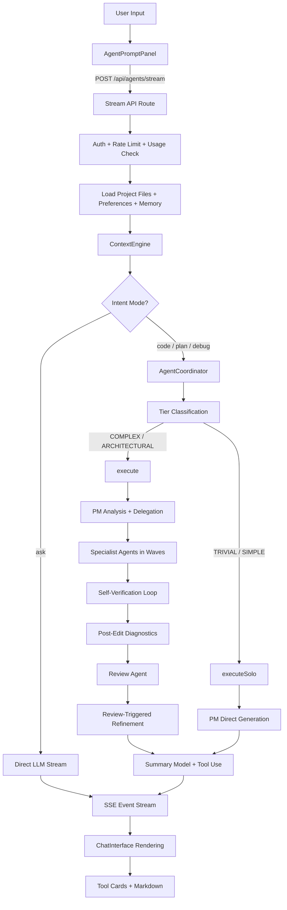
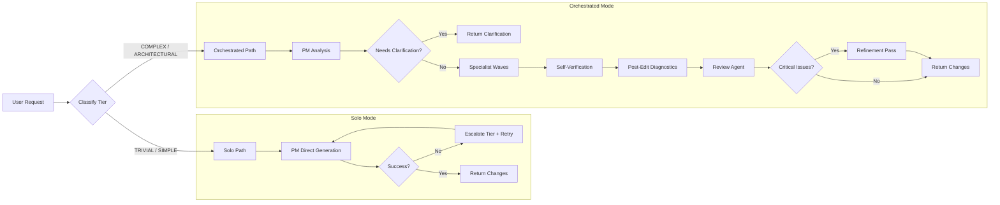

# Synapse AI Architecture

This document describes how the AI system in Synapse works end-to-end -- from user input to rendered response. It covers the provider layer, model routing, context engine, agent orchestration, tool system, streaming pipeline, and UI rendering.

---

## High-Level Request Lifecycle



---

## 1. AI Provider Layer

Three providers implement a common interface and are swapped transparently.

### Common Interface

Defined in [`lib/ai/types.ts`](lib/ai/types.ts):

```typescript
interface AIProviderInterface {
  readonly name: AIProvider;                                    // 'anthropic' | 'openai' | 'google'
  complete(messages, options?): Promise<AICompletionResult>;    // Single-shot completion
  stream(messages, options?): Promise<StreamResult>;            // Streaming completion
}
```

An extended `AIToolProviderInterface` adds `completeWithTools()` and `streamWithTools()` for structured tool use (Anthropic only).

### Providers

| Provider | SDK | Models | Default |
|----------|-----|--------|---------|
| **Anthropic** | `@anthropic-ai/sdk` | `claude-opus-4-6`, `claude-sonnet-4-5-20250929`, `claude-haiku-4-5-20251001` | Sonnet 4.5 |
| **OpenAI** | `openai` | `gpt-4o`, `gpt-4o-mini` | gpt-4o-mini |
| **Google** | `@google/generative-ai` | `gemini-2.0-flash`, `gemini-2.0-flash-lite` | gemini-2.0-flash |

Implementation files:
- [`lib/ai/providers/anthropic.ts`](lib/ai/providers/anthropic.ts) -- adaptive thinking, prompt caching, citations, structured outputs
- [`lib/ai/providers/openai.ts`](lib/ai/providers/openai.ts) -- standard chat completions
- [`lib/ai/providers/google.ts`](lib/ai/providers/google.ts) -- Generative AI SDK (upgradeable to Vertex AI)

### Factory

[`lib/ai/get-provider.ts`](lib/ai/get-provider.ts) creates singleton instances:

```typescript
const provider = getAIProvider('anthropic');
const result = await provider.stream(messages, { model: 'claude-sonnet-4-5-20250929' });
```

---

## 2. Model Router

[`lib/agents/model-router.ts`](lib/agents/model-router.ts) performs action-based multi-model routing.

### Resolution Priority

```
1. ARCHITECTURAL tier escalation  (PM always gets Opus)
2. Action override                (MODEL_MAP[action])
3. User preference                (from useAgentSettings / localStorage)
4. Agent default                  (AGENT_DEFAULTS[agentRole])
5. System default                 (Sonnet 4.5)
```

### Action-to-Model Map

| Action | Model | Rationale |
|--------|-------|-----------|
| `analyze`, `plan` | Claude Opus | Deep reasoning for analysis and planning |
| `generate`, `fix`, `refactor`, `explain`, `document`, `chat` | Claude Sonnet | Speed/quality balance for code generation |
| `review` | GPT-4o | Cross-provider diversity for quality checks |
| `summary`, `classify`, `classify_trivial` | Claude Haiku | Fast and cheap for lightweight tasks |

### Agent Defaults

| Agent | Default Model |
|-------|--------------|
| Project Manager | Claude Opus |
| Liquid Specialist | Claude Sonnet |
| JavaScript Specialist | Claude Sonnet |
| CSS Specialist | Claude Sonnet |
| Review Agent | GPT-4o |
| Summary Model | Claude Haiku |

### Provider Detection

Model IDs are auto-detected: `claude-*` routes to Anthropic, `gpt-*`/`o1*`/`o3*` to OpenAI, `gemini-*` to Google.

### Adaptive Thinking

`analyze` and `plan` actions enable Claude's adaptive thinking (internal reasoning scratchpad). Effort levels (`low`/`medium`/`high`/`max`) are mapped per action in `ACTION_EFFORT`.

---

## 3. Context Engine

[`lib/ai/context-engine.ts`](lib/ai/context-engine.ts) replaces the legacy `context-builder.ts` with a 16,000-token context window (up from 4,000).

### File Indexing

On load, `indexFiles()` builds metadata for every project file:
- Token estimate, file type, size, last modified
- Outgoing references extracted from content:
  - Liquid: ``, ``, ``, `{{ 'x' | asset_url }}`
  - Template JSON: section types from `sections` objects

### Context Assembly

`buildContext()` assembles files within a token budget:

```
1. Reserve space for developer memory (Layer 8)
2. Include priority files (always first)
3. Include requested files
4. Auto-resolve transitive dependencies
5. Fill remaining budget with relevant files
6. Record excluded files
```

### Fuzzy Matching

`fuzzyMatch()` scores files using:
- Exact filename match (+10)
- Theme topic pattern match (+8 to +10) via `THEME_TOPIC_MAP`
- Path segment matches (+5 per word)
- File-type relevance (+3)
- Recency boost (+1)

The theme-aware topic map translates natural language ("hero", "cart", "header") into file patterns (`sections/hero-banner*.liquid`, `assets/cart*.js`).

### Dependency Resolution

`resolveWithDependencies()` performs transitive closure -- if `sections/header.liquid` renders `snippets/nav.liquid` which renders `snippets/icon.liquid`, all three are included.

---

## 4. Agent Orchestration

[`lib/agents/coordinator.ts`](lib/agents/coordinator.ts) manages the full execution lifecycle via `AgentCoordinator`.

### Execution Modes



### Orchestrated Mode (`execute()`)

1. **Tier classification**: Auto-classifies request complexity (TRIVIAL/SIMPLE/COMPLEX/ARCHITECTURAL)
2. **Parallel context building**: Dependency, design, DOM, and file group context loaded via `Promise.all`
3. **PM analysis**: Project Manager analyzes request, creates delegation plan
4. **Scope assessment gate**: Returns clarification if request is too broad (>5 files, ambiguous)
5. **Specialist execution**: Runs specialists in dependency-ordered waves
   - Builds file-conflict graph to prevent concurrent edits to the same file
   - Uses graph coloring for wave assignment
   - Concurrency limit: 4 parallel agents
6. **Inter-agent refinement**: Specialists see each other's proposals
7. **File context rule**: Rejects changes to files not loaded in context
8. **Self-verification loop**: Validates syntax, types, schema, and references
9. **Post-edit diagnostics**: Runs `run_diagnostics` on changed files
10. **Review agent**: Mandatory review of all changes
11. **Review-triggered refinement**: Fixes critical issues found by review
12. **Preview verification** (optional): DOM snapshot comparison for COMPLEX/ARCHITECTURAL tiers

### Solo Mode (`executeSolo()`)

1. PM generates changes directly via `executeDirectPrompt()`
2. On failure or empty results, escalates tier and retries
3. No specialists, no review agent
4. Faster for simple single-file edits

---

## 5. Agent Classes

All agents extend the abstract `Agent` class in [`lib/agents/base.ts`](lib/agents/base.ts).

### Base Agent

```
Agent (abstract)
  ├── execute()              Main entry with retry/fallback
  ├── executeDirectPrompt()  Direct prompt execution (solo mode)
  ├── executeWithTools()     Tool-calling loop (up to 10 iterations)
  ├── executeSingle()        Single AI call with budget enforcement
  ├── enforceRequestBudget() Truncates context to fit token limits
  └── getLastUsage()         Returns input/output token counts
```

Features: multi-provider support, structured retries, 120s timeout, tier-aware model escalation, tool calling, structured JSON output.

### Specialist Agents

| Agent | File Types | Token Budget | Location |
|-------|-----------|-------------|----------|
| `LiquidAgent` | `.liquid` | 35,000 | [`lib/agents/specialists/liquid.ts`](lib/agents/specialists/liquid.ts) |
| `JavaScriptAgent` | `.js`, `.ts` | 35,000 | [`lib/agents/specialists/javascript.ts`](lib/agents/specialists/javascript.ts) |
| `CSSAgent` | `.css`, `.scss` | 35,000 | [`lib/agents/specialists/css.ts`](lib/agents/specialists/css.ts) |
| `JSONAgent` | `.json` | 25,000 | [`lib/agents/specialists/json.ts`](lib/agents/specialists/json.ts) |

All specialists prefer patch output (search/replace pairs) over full-file replacements. Confidence scoring aggregates across changes.

### Other Agents

| Agent | Role | Location |
|-------|------|----------|
| `ProjectManagerAgent` | Analyzes requests, delegates to specialists, generates code in solo mode | [`lib/agents/project-manager.ts`](lib/agents/project-manager.ts) |
| `ReviewAgent` | Quality assurance -- programmatic checks + AI review (does not modify code) | [`lib/agents/review.ts`](lib/agents/review.ts) |

### Worker Pool

[`lib/agents/worker-pool.ts`](lib/agents/worker-pool.ts) provides parallel sub-task execution:
- Semaphore-based concurrency (max 4 workers)
- Read-only tool access
- 60s timeout per worker
- Progress events for UI updates

---

## 6. Tool System

### Tool Definitions

[`lib/agents/tools/definitions.ts`](lib/agents/tools/definitions.ts) defines 33 tools with JSON Schema validation.

**Coordinator-phase tools** (used during agent execution):

| Category | Tools |
|----------|-------|
| File reading | `read_file`, `search_files`, `list_files`, `get_dependency_graph` |
| Search | `grep_content`, `glob_files`, `semantic_search` |
| Validation | `validate_syntax`, `run_diagnostics` |
| Parallel work | `spawn_workers` |
| Web | `fetch_url`, `web_search` |
| File mutation | `write_file`, `delete_file`, `rename_file` |
| Preview DOM | `inspect_element`, `get_page_snapshot`, `query_selector`, `inject_css`, `inject_html` |
| Shopify | `push_to_shopify`, `pull_from_shopify`, `list_themes`, `list_store_resources`, `get_shopify_asset` |
| Visual regression | `screenshot_preview`, `compare_screenshots` |
| Theme validation | `theme_check`, `generate_placeholder` |

**Summary-phase tools** (used by the summary model to produce interactive UI):

| Tool | Purpose |
|------|---------|
| `propose_plan` | Multi-step plan with checkable steps |
| `propose_code_edit` | Code change with diff preview |
| `ask_clarification` | Question with clickable options |
| `navigate_preview` | Navigate the preview panel |
| `create_file` | Create a new file with confirmation |

### Tool Execution

[`lib/agents/tools/tool-executor.ts`](lib/agents/tools/tool-executor.ts) dispatches tool calls via a switch statement. The `ToolExecutorContext` provides:

```typescript
interface ToolExecutorContext {
  files: FileContext[];              // Project files in context
  contextEngine: ContextEngine;      // For file matching and search
  projectId: string;                 // Required for most tools
  userId: string;                    // Required for Shopify credential resolution
  loadContent?: LoadContentFn;       // Hydrate file stubs on demand
  agentContext?: AgentContext;        // Required for spawn_workers
  onProgress?: Function;             // Worker progress callback
  supabaseClient?: SupabaseClient;   // Required for file mutations
  shopifyConnectionId?: string;      // Required for Shopify operations
  themeId?: string;                  // Required for Shopify operations
}
```

### Read-Only Tool Classification

The worker pool restricts workers to read-only tools: `read_file`, `search_files`, `list_files`, `get_dependency_graph`, `grep_content`, `glob_files`, `semantic_search`, `run_diagnostics`, `validate_syntax`, `fetch_url`, `web_search`, `inspect_element`, `get_page_snapshot`, `query_selector`, `list_themes`, `list_store_resources`, `get_shopify_asset`, `theme_check`, `generate_placeholder`.

Mutation tools (`write_file`, `delete_file`, `rename_file`, `inject_css`, `inject_html`, `push_to_shopify`, `pull_from_shopify`, `screenshot_preview`, `compare_screenshots`) are coordinator-only.

---

## 7. Prompt Engineering

[`lib/agents/prompts.ts`](lib/agents/prompts.ts) contains all system prompts.

| Prompt | Used By | Purpose |
|--------|---------|---------|
| `PROJECT_MANAGER_PROMPT` | PM in orchestrated mode | Full analysis, delegation, and pattern detection |
| `SOLO_PM_PROMPT` | PM in solo mode | Single-pass code generation with self-review |
| `PM_PROMPT_LIGHTWEIGHT` | PM for TRIVIAL tier | Minimal context, fast classification |
| `LIQUID_AGENT_PROMPT` | LiquidAgent | Liquid file modifications with motion-first patterns |
| `JAVASCRIPT_AGENT_PROMPT` | JavaScriptAgent | JS/TS modifications with animation recipes |
| `CSS_AGENT_PROMPT` | CSSAgent | CSS modifications with motion-first library |
| `JSON_AGENT_PROMPT` | JSONAgent | JSON config modifications |
| `REVIEW_AGENT_PROMPT` | ReviewAgent | Quality review with severity scoring |

All specialist prompts include **motion-first generation** patterns (scroll animations, `prefers-reduced-motion`, schema motion controls).

---

## 8. Summary Layer

[`lib/agents/summary-prompt.ts`](lib/agents/summary-prompt.ts) converts structured `AgentResult` into conversational responses.

### Flow

```
AgentResult (changes, analysis, review) 
  -> buildSummaryMessages() 
  -> Summary model (Haiku) with streaming tool use
  -> SSE events (text chunks + tool calls)
```

### Output Modes

| Mode | Format |
|------|--------|
| `chat` | Conversational explanation |
| `plan` | Numbered plan with complexity estimates |
| `review` | Scored report (0-100) grouped by category |
| `fix` | Focus on the applied fix |
| `generate` | Focus on generated code |
| `document` | Documentation with headings and examples |

The summary model can invoke tools (`propose_code_edit`, `propose_plan`, `ask_clarification`, `navigate_preview`, `create_file`) to produce interactive UI cards instead of plain text.

---

## 9. SSE Streaming Pipeline

### API Route

[`app/api/agents/stream/route.ts`](app/api/agents/stream/route.ts) accepts a POST request and returns a Server-Sent Events stream.

### Event Types

| Event | Payload | Purpose |
|-------|---------|---------|
| `thinking` | `{ phase, label, detail?, agent? }` | Real-time progress from coordinator |
| `tool_start` | `{ name, id }` | Tool call initiated (shows loading skeleton) |
| `tool_call` | `{ name, input }` | Tool call completed (renders UI card) |
| `context_stats` | `{ loadedFiles, loadedTokens, totalFiles }` | Context loading metrics |
| `error` | `{ code, message, provider?, retryable? }` | Structured error |
| `done` | `{}` | Stream completed |
| *(raw text)* | Markdown string | Streamed content chunks |

### Frontend Processing

[`components/features/agents/AgentPromptPanel.tsx`](components/features/agents/AgentPromptPanel.tsx) reads the stream via the `ReadableStream` API:

1. Parses SSE events with regex-based `parseSSEEvent()`
2. Routes `tool_call` events to appropriate accumulators (plan data, code edits, file ops, etc.)
3. Accumulates raw text chunks with 100ms debouncing to reduce re-renders
4. Detects stalls (warning at 60s, alert at 120s)
5. Finalizes message and persists to database on `done`

---

## 10. UI Card System

[`components/ai-sidebar/ChatInterface.tsx`](components/ai-sidebar/ChatInterface.tsx) renders AI responses as a mix of Markdown content and interactive tool cards.

### Card Mapping

| Tool | Component | Interaction |
|------|-----------|-------------|
| `propose_plan` | `PlanCard` | Checkable steps, "View Plan" / "Build" buttons |
| `propose_code_edit` | `CodeEditCard` | Diff preview, Accept / Reject buttons |
| `ask_clarification` | `ClarificationCard` | Clickable option buttons (sends as new message) |
| `navigate_preview` | `PreviewNavToast` | Inline notification with preview path |
| `create_file` | `FileCreateCard` | File preview, Confirm / Cancel |
| `write_file` / `delete_file` / `rename_file` | `FileOperationToast` | Status toast with file operation results |
| `push_to_shopify` / `pull_from_shopify` / etc. | `ShopifyOperationCard` | Operation status card |
| `screenshot_preview` / `compare_screenshots` | `ScreenshotCard` | Expandable screenshot display with comparison |

### ChatMessage Interface

The `ChatMessage` type carries all metadata for rendering:

```typescript
interface ChatMessage {
  id: string;
  role: 'user' | 'assistant';
  content: string;                    // Markdown text
  timestamp: Date;
  thinkingSteps?: ThinkingStep[];     // Progress rail
  contextStats?: ContextStats;        // File/token counts
  planData?: PlanData;                // PlanCard data
  codeEdits?: CodeEdit[];             // CodeEditCard data
  clarification?: Clarification;      // ClarificationCard data
  fileCreates?: FileCreate[];         // FileCreateCard data
  fileOps?: FileOperation[];          // FileOperationToast data
  shopifyOps?: ShopifyOperation[];    // ShopifyOperationCard data
  screenshots?: Screenshot[];         // ScreenshotCard data
  screenshotComparison?: Comparison;  // ScreenshotCard comparison
  activeToolCall?: { name; id };      // Loading skeleton while tool executes
  citations?: Citation[];             // Source citations
}
```

---

## 11. Architectural Principles (p0)

These are enforced by the coordinator and embedded in agent prompts:

1. **File Context Rule** -- Reject changes to files not loaded in the current context. Prevents hallucinated edits to files the agent hasn't read.

2. **Scope Assessment Gate** -- PM returns `needsClarification` for broad or ambiguous requests touching many files. Up to 2 clarification rounds before forcing execution.

3. **Verification First-Class** -- Review agent is mandatory in orchestrated mode. Self-verification loop validates syntax, types, and references before review.

4. **Testing Always First** -- "Verify this works" suggestion chip auto-injected after code changes.

5. **Discussion Default** -- Prefer asking for clarification over guessing intent. Agents default to conversation when uncertain.

6. **Parallel over Sequential** -- Context building, specialist execution, and validation use `Promise.all` wherever independent.

7. **Least Invasive Change** -- Prefer patches (search/replace) over full-file replacements. Minimize diff size.

---

## 12. Data Flow Summary

```
User types message
  |
  v
AgentPromptPanel enriches with:
  - Element context (if preview element selected)
  - Editor selection
  - Attached files + pinned preferences
  - Preview DOM snapshot (if preview open)
  |
  v
POST /api/agents/stream
  |
  v
API Route:
  - Authenticates user, checks rate limits + usage
  - Loads project files, preferences, developer memory
  - Builds ContextEngine
  |
  +-- ASK mode: streams directly from LLM
  |
  +-- CODE/PLAN/DEBUG mode:
      |
      v
    AgentCoordinator
      - Classifies tier
      - Solo: PM generates directly
      - Orchestrated: PM delegates -> specialists -> verify -> review
      |
      v
    Summary model (Haiku) with tool use
      - Converts AgentResult to conversational response
      - Invokes tools for interactive UI (plans, code edits, etc.)
      |
      v
    SSE stream -> Frontend
      - Text chunks -> Markdown rendering
      - Tool calls -> Interactive UI cards
      - Thinking events -> Progress rail
      |
      v
    ChatInterface renders final message
      - Markdown + tool cards
      - Persisted to database via useAgentChat
```

---

## Key File Reference

| Area | Files |
|------|-------|
| Core types | [`lib/ai/types.ts`](lib/ai/types.ts) |
| Provider factory | [`lib/ai/get-provider.ts`](lib/ai/get-provider.ts) |
| Providers | [`lib/ai/providers/`](lib/ai/providers/) |
| Model routing | [`lib/agents/model-router.ts`](lib/agents/model-router.ts) |
| Context engine | [`lib/ai/context-engine.ts`](lib/ai/context-engine.ts) |
| Coordinator | [`lib/agents/coordinator.ts`](lib/agents/coordinator.ts) |
| Base agent | [`lib/agents/base.ts`](lib/agents/base.ts) |
| Specialists | [`lib/agents/specialists/`](lib/agents/specialists/) |
| Project Manager | [`lib/agents/project-manager.ts`](lib/agents/project-manager.ts) |
| Review agent | [`lib/agents/review.ts`](lib/agents/review.ts) |
| Worker pool | [`lib/agents/worker-pool.ts`](lib/agents/worker-pool.ts) |
| Tool definitions | [`lib/agents/tools/definitions.ts`](lib/agents/tools/definitions.ts) |
| Tool executor | [`lib/agents/tools/tool-executor.ts`](lib/agents/tools/tool-executor.ts) |
| System prompts | [`lib/agents/prompts.ts`](lib/agents/prompts.ts) |
| Summary layer | [`lib/agents/summary-prompt.ts`](lib/agents/summary-prompt.ts) |
| Stream API | [`app/api/agents/stream/`](app/api/agents/stream/) |
| Execute API | [`app/api/agents/execute/route.ts`](app/api/agents/execute/route.ts) |
| Frontend SSE | [`components/features/agents/AgentPromptPanel.tsx`](components/features/agents/AgentPromptPanel.tsx) |
| Chat UI | [`components/ai-sidebar/ChatInterface.tsx`](components/ai-sidebar/ChatInterface.tsx) |
| Chat hook | [`hooks/useAgentChat.ts`](hooks/useAgentChat.ts) |
| Error handling | [`lib/ai/errors.ts`](lib/ai/errors.ts) |
| Developer memory | [`lib/ai/developer-memory.ts`](lib/ai/developer-memory.ts) |
| Web search | [`lib/ai/web-search.ts`](lib/ai/web-search.ts) |
